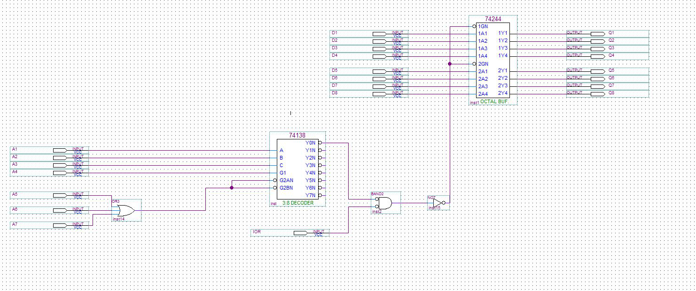
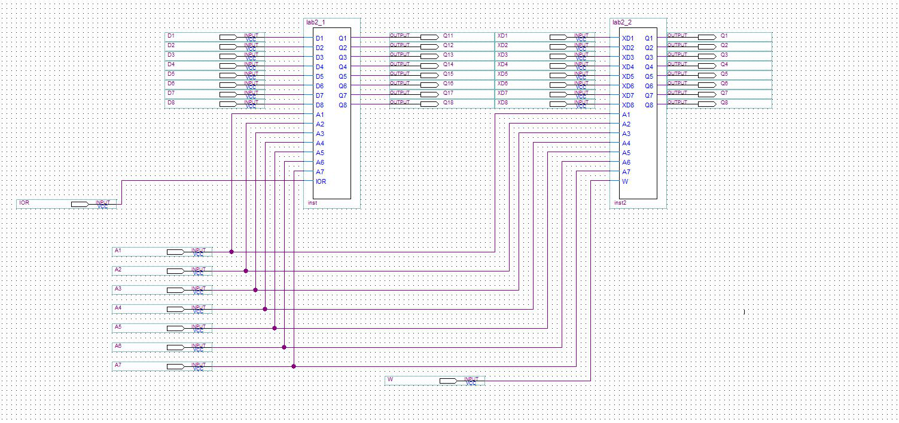
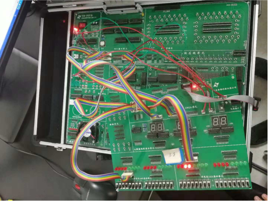

## 实验2:手动数字量输入与无条件输入端口的构成

### 实验电路

#### 无条件输入端口的地址译码:



#### 总的地址译码电路



### 实验电路连接及结果展示

####电路连接方法：

##### 将实验箱上的IOR、IOW经过转换单元进行转换，然后将其与实验箱的地址线的A1至A7一起作为JATG芯片的输入，用来进行地址译码以及无条件输入输出的控制信号，之后将无条件输入端口的输出和无条件输出端口的输入接到实验箱的D0-D7即可完成实验电路的连线

#### 结果及电路展示



### 实验程序代码

#### 实验3的循环程序:

```c
#include <stdio.h>  
#include <stdlib.h>  
#include <conio.h>  
#include <bios.h>  
#include <ctype.h>  
#include <process.h>  
void key(void);  

void main()  
{  
    char a = '0';     
    while(1)  
    {  
        a = inp(0x3010);  
        printf("%c",a);  
        a = a<<3;  //进行左移，使得其表示的结果与之前不同
        outp(0x3010, a);      
    }  
    key();  
}  
  
void key(void)  
{  
    if (bioskey(1) != 0)  
    {  
        exit(0);  
    }  
}  
```
