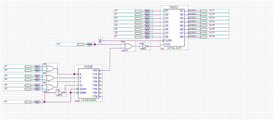
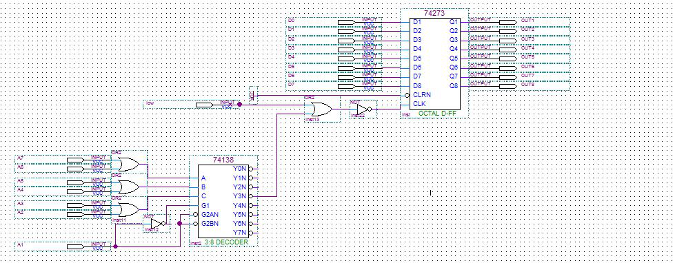
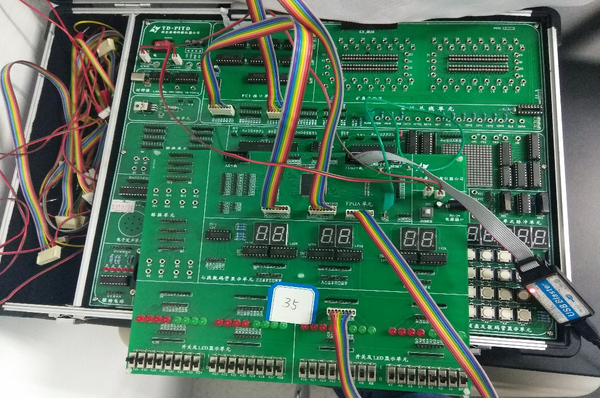

## 实验1:无条件输出端口的构成与地址译码

### 实验电路

#### 实验译码电路如下



#### 改变后电路



### 实验代码

####实现输出数据至端口的程序段：

```c
void main()  
{  
    char a = 0x01;  
    outp(0x3000,a);  
}
```

#### 让LED灯呈现规律性变化的程序段

```c
void main()  
{  
    char a = 0x01;  
    while(true)  
    {  
        outp(0x3000,a);  
        if(data>>7)  
        {  
    		data = data>>7;  
        }  
        else  
        { 
            data = data<<1;  
        }  
    }  
}
```

### 实验电路连接及结果展示

#### 电路连接方法:

##### 将IOW通过实验箱上的转换单元转换后与地址线A1至A7、数据线D0至D7一起作为芯片的输入，然后将芯片绑定的输出引脚与LED模块连接一起，即可完成无条件输出电路的搭建

#### 结果及电路展示

