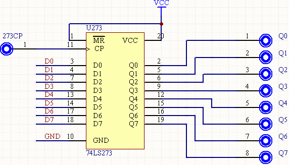
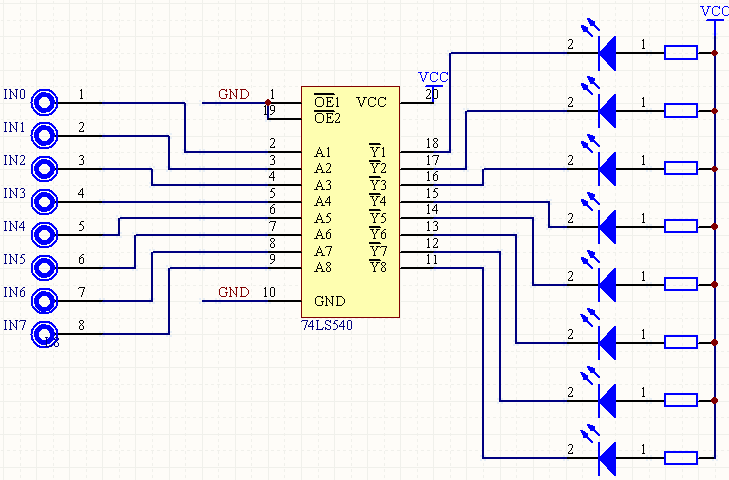

# 实验一：无条件输出端口与地址译码

> 小组成员:吕建瑶1811400,郑佶1811464,吴京1811440

## 1. 实验目的

1. 掌握无条件输出端口的构成以及如何对其进行写操作；

2. 学会利用 QuartusII 设计地址译码电路的构建方法。 


## 2. 实验背景

无条件输出端口和无条件输入端口是构建接口电路的基础。从原理上看，无条件输出
端口是由寄存器、地址译码器和负与逻辑构成的。利用 FPGA 芯片可构成一个典型的 8 位无
条件输出端口。无条件输出端口模块处实际是一个进行了相关连接的 8 位寄存器（74LS273），
如图所示：


图中，74LS273 的数据输入端需要和实验箱提供的系统数据总线的低 8 位（XD7～XD0）
相连（组成无条件输出端口时通常要求这样连），输出端分别接到 8 个插孔（标注为 Q7～Q0），
打入脉冲输入端也安排了一个插孔（标注为 273CP）。为了方便观看写入到该输出端口的值，
可将 74LS273 的输出接到 LED 显示模块的输入。注意，QuartusII 中的 74273 是由数字逻辑
生成的电路，其引脚与此图有细微差别。
实验板 LED 显示模块的电路如下图所示：


图中，74LS540 为八反相缓冲器/驱动器，参数之一 IOL（低电平输出电流，即输出为低时的灌入电流）为 24mA，足可以点亮发光二极管 LED。在其 8 个输入端均安排了插孔，从低位到高位依次标注为 IN0～IN7。注意，由于一般实验板中的 LED 灯均已配置 74LS540或其他类似功能的驱动电路芯片，故而不需要再在 FPGA 板中设计实现 74LS540 的相关电路了。

在 74LS273 的输出与 74LS540 的输入对应相连的情况下，当 74LS273 的某位为 1，则对应的 LED 亮，为 1，则对应的 LED 灭（因为 74LS540 为反相逻辑）。构建无条件输出端口除寄存器外，还需要地址译码器。本次实验的地址译码电路可以自行设定。构成无条件输出端口的关键是产生寄存器的打入脉冲，实际上它是 IO 写信号（IOW#）和地址译码信号的负与。写入时刻是负与逻辑输出负脉冲的后沿。

建议利用 74LS138，74LS273 以及 IOW 信号构成译码电路。注意由于实验开发环境将windows的资源配置进行了重新分配，实验中我们使用的I/O地址范围为0x3000H-0x30FFH。注意由于实验开发环境将windows的资源配置进行了重新分配，实验中我们使用的I/O地址范围为0x3000H-0x30FFH。因此其中地址译码的实际连线部分可以用 A1－A7（A0 不要用），但程序指令必须符合该范围。

## 3. 实验内容

1. 构建无条件输出端口，自主设计译码电路，由 FPGA 芯片实现。编一程序，给该无条件输出端口输出不同的数，将 74LS273 的输出接 LED 显示模块,用循环方法让 8 个 LED 呈现规律性变化，变化规律自行设计。
2. 改变地址译码电路，体会改变后的地址与改变前的地址在程序中的不同之处。

## 4. 译码电路


## 5. 程序代码

```c
#include<stdio.h>
#include<stdlib.h>
#include<conio.h>
#include<ctype.h>
#include<process.h>
void main()
{
	//outp(0x3000,0x00);
	long i,k;
	
	for (i = 0; 1; i++)
	{
		if (i >= 128)
			i -= 128;
		for (k = 0; k < 500000000; k++)
			;//延迟
		outp(0x3000, 0x00 + i);
	}
}
```

## 6. 系统接线图


## 7. 实验连线图


​                          