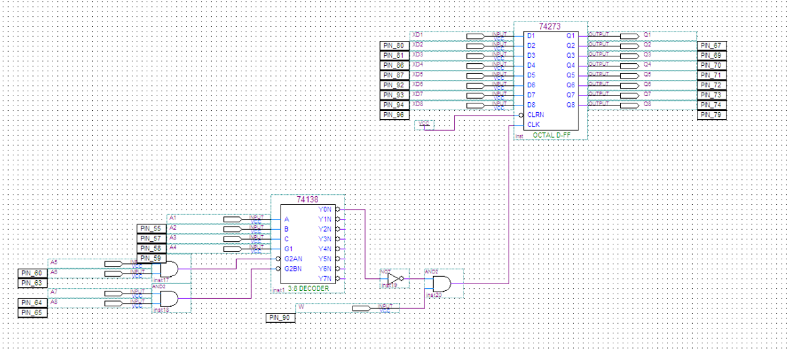
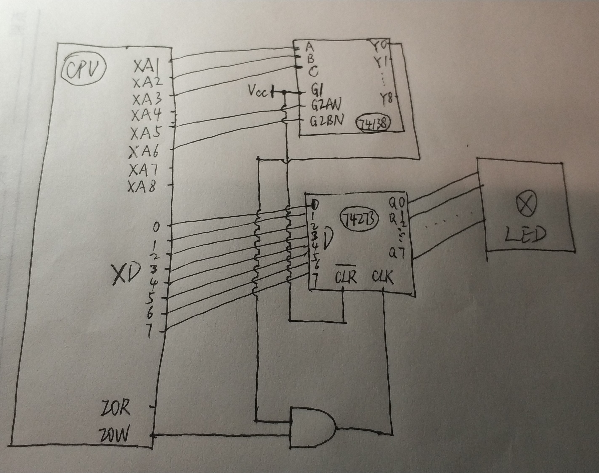
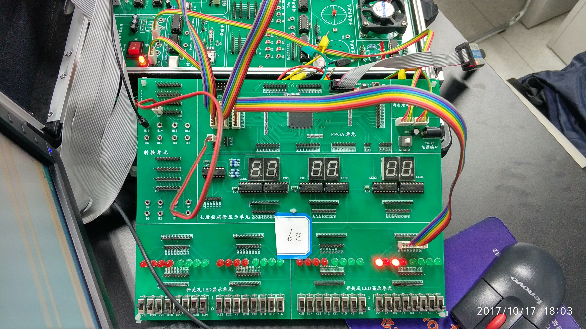
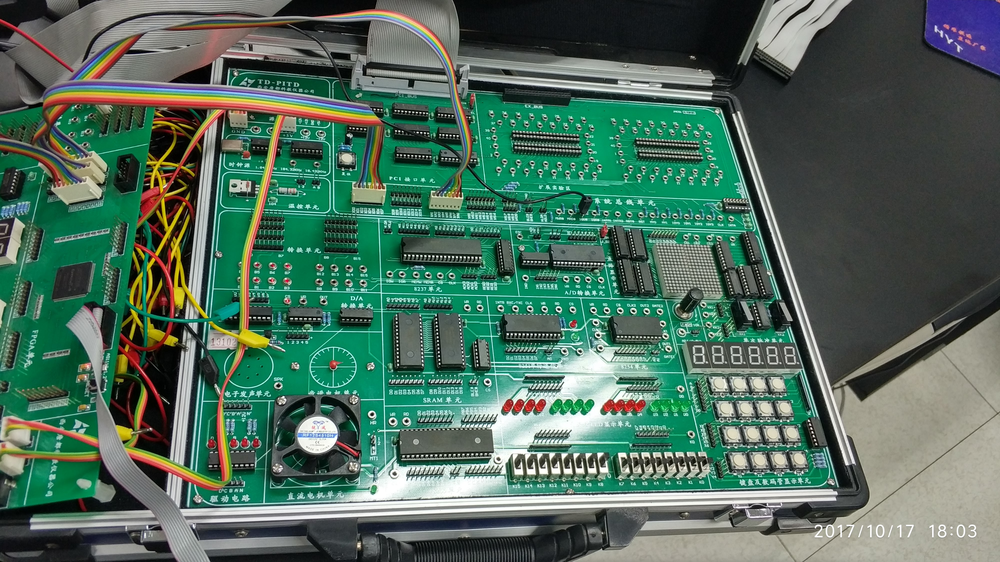

# 实验一：无条件输出端口与地址译码

> 小组成员:吕建瑶1811400,郑佶1811464,吴京1811440

##  实验内容

1. 构建无条件输出端口，自主设计译码电路，由 FPGA 芯片实现。编一程序，给该无条件输出端口输出不同的数，将 74LS273 的输出接 LED 显示模块,用循环方法让 8 个 LED 呈现规律性变化，变化规律自行设计。
2. 改变地址译码电路，体会改变后的地址与改变前的地址在程序中的不同之处。

##  译码电路



## 程序代码

```c
#include<stdio.h>
#include<stdlib.h>
#include<conio.h>
#include<ctype.h>
#include<process.h>
void main()
{
	//outp(0x3000,0x00);
	long i,k;
	for (i = 0; 1; i++)
	{
		if (i >= 128)i -= 128;
		for (k = 0; k < 500000000; k++);
		outp(0x3000, 0x00 + i);
	}
}
```

## 系统接线图



##  实验连线图



```
```

