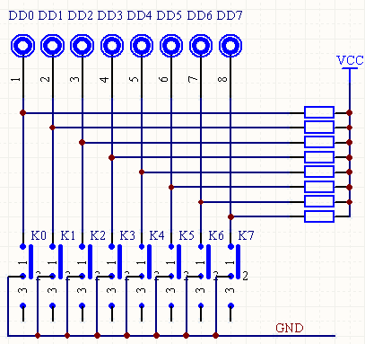
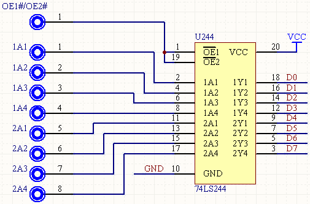
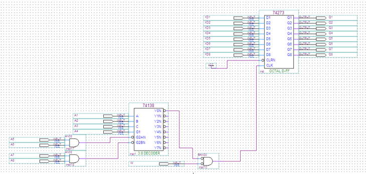
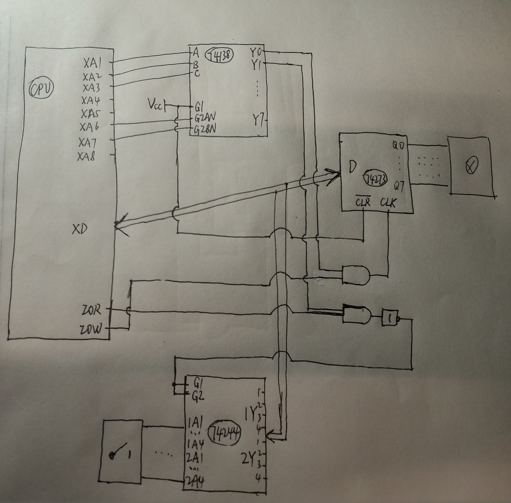
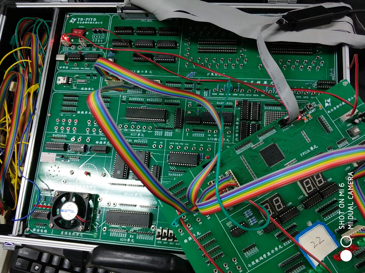

# 实验2：手动数字量输入与无条件输入端口的构成

> 小组成员:吕建瑶1811400,郑佶1811464,吴京1811440

## 1. 实验目的

1. 了解什么是数字量输入,手动数字量输入有什么用途；
2. 学会无条件输入端口的构成以及对其进行读操作。

## 2. 实验背景

数字量输入是指输入信号是数字量即数字信号。为使实验者对数字量输入有个直观了解，实验板提供了 8 位手动数字量输入模块。该模块由 8 个开关和一个排电阻（此为 A 型排电阻，所有电阻被封装在一起，而它们的一端被连在一起，作为公共端）组成，具体电路如下图所示：



开关拨到上方表示 1，否则表示 0（在实验板上，每个开关的接点 3 位于上方，而接点 1 位于下方）。该模块的输出 DD7～DD0（安排有插孔）可作为无条件输入端口的输入；也可直接接 LED 显示模块，即由手拨开关控制 LED 的亮灭；还可以接七段数码显示模块，以控制数码显示。在实际应用中手动数字量输入通常用来控制一些设备或装置的动作，或进行分步操作。

无条件输入端口通常也是接口的组成部分。从原理上看，无条件输入端口是由三态门、地址译码器和负与逻辑构成的。利用 FPGA 板可构成一个典型的 8 位无条件输入端口。无条件输入端口电路实际是一个进行了相关连接的八三态门（74LS244），如下图所示：



74LS244 内部的 8 个三态门被分成两组。1A1～1A4 分别是第一组四个三态门的输入，1Y1～1Y4 分别是第一组四个三态门的输出，2A1～2A4 是第二组的输入，2Y1～2Y4 是第二组的输出两组三态门分别设置了控制信号（OE1#和 OE2#），低电平有效，即控制信号为低电平时，对应的一组三态门为开放状态，否则为关闭状态。

构成无条件输入端口的关键是产生三态门的控制信号，实际上它是 IO 读信号（IOR#）和地址译码信号的负与。

## 3. 实验内容

1. 将手动数字量输入模块的输出接 LED 显示模块，拨动开关，观察 LED 的亮灭；
2. 构建无条件输入端口，输入数据由手动数字量输入模块提供，编一程序，读该端口并显示在屏幕上；
3. 设计电路并编写循环程序，在循环体中，先读入无条件输入端口的数值，经过处理后再向无条件输出端口输出，并接 LED 显示模块，要求输入数据与输出数据呈现不同规律。

## 4. 译码电路



## 5. 程序代码

```c
#include<stdio.h>
#include<stdlib.h>
#include<conio.h>
#include<bios.h>
#include<ctype.h>
#include<process.h>
void main()
{
	int p = 0;//要读入的数据
	int i, j;
	for (i = 0; i < 1000000; i++)
	{
		p = inp(0x3001);
		printf("%d ", p);	
		outp(0x3000, p * 2 + 1);
		for(j = 0; j < 32000; j++)
		{
			;//延迟
		}
	}
}
```

## 6. 系统接线图



## 7. 实验连线图




