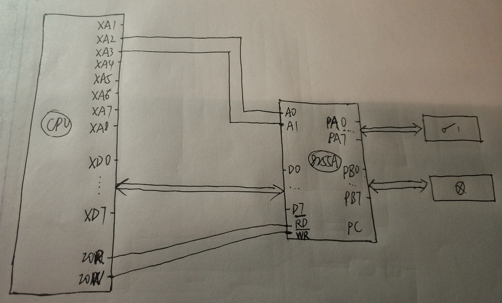
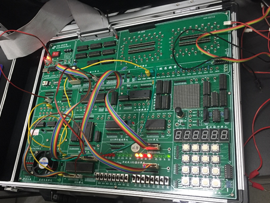

# 实验3：可编程接口芯片 8255A 的使用

> 小组成员:吕建瑶1811400,郑佶1811464,吴京1811440

## 实验内容

1. 将手动数字量输入模块的输出（K7～K0）接 8255A 的 A 口（PA7～PA0）.编程时,先将 A 口设置成方式 0 输入,B 口设置成方式 0 输出（C 口未用,方式自定,<u>以下实验未用的端口均自行设定</u>）,然后安排一个循环结构,读 A 口,并用二进制形式显示读入值.在程序运行期间,拨动开关,观察显示是否与开关状态一致.
2. 在实验①基础上,将 B 口的 8 个引脚（插孔）和 LED 显示模块相连.读 A 口,将读入值输出至 B 口.在程序运行期间,拨动开关,观察 LED 的变化.
3. 去掉实验①和②的连线,将 A 口（PA7～PA0）和 B 口（PB7～PB0）连接起来,并同时和 LED 显示模块相连.编程时,将 A 口设置成方式 0 输出、B 口设置成方式 0 输入,通过循环给 A 口输出不同的数,读 B 口,并显示（进位制自定）.此期间,观察 LED的变化.
4. 不改变实验③的连线,将 A 口和 B 口的设置反过来,即将 A 口设置成方式 0 输入、B口设置成方式 0 输出,通过循环给 B 口输出不同的数,读 A 口,并显示（进位制自定）.
5. 去掉 8255A 的所有连线,将 C 口（PC7～PC0）和 LED 显示模块连接起来.编程时,将C 口设置成方式 0 输出,通过循环,向 C 口输出,使 LED 呈现规律性变化（变化规律自行设计）.
6. 保留实验⑤的连线,编程时,仍将 C 口设置成方式 0 输出,但要求通过置位/复位操作,使 LED 呈现规律性变化（变化规律同实验⑤或重新设计）.

## 程序代码

```c
//1.c
#include <stdio.h>
#include <stdlib.h>
#include <conio.h>
#include <bios.h>
#include <ctype.h>
#include <process.h>

void key(void);

//****************根据查看配置信息修改下列符号值*******************
#define  IOY0         0x3000
//*****************************************************************
#define  MY8255_A     IOY0 + 0x00*2
#define  MY8255_B     IOY0 + 0x01*2
#define  MY8255_C     IOY0 + 0x02*2
#define  MY8255_MODE  IOY0 + 0x03*2

void main()
{
	int a;
	char buff[9];

	//10010000
	outp(MY8255_MODE, 0x90);

	while(1)
	{
		a = inp(MY8255_A);
		printf("%d ", a);
		itoa(a, buff, 2);
		printf("%s\n", buff);
		outp(MY8255_B, a);
		key();
	}
}

void key(void)
{
	if (bioskey(1) != 0)
	{
		exit(0);
	}
}
```

```c
//3.c
#include <stdio.h>
#include <stdlib.h>
#include <conio.h>
#include <bios.h>
#include <ctype.h>
#include <process.h>

void key(void);
void delay(int time);

//****************根据查看配置信息修改下列符号值*******************
#define  IOY0         0x3000
//*****************************************************************
#define  MY8255_A     IOY0 + 0x00*2
#define  MY8255_B     IOY0 + 0x01*2
#define  MY8255_C     IOY0 + 0x02*2
#define  MY8255_MODE  IOY0 + 0x03*2

void main()
{

	int a, b, i;
	char buff[9];

	//10000010
	outp(MY8255_MODE, 0x82);
	a = 0;
	printf("Start...\n");
	while(1)
	{
		delay(0x1000);
		outp(MY8255_A, a);
		delay(0x1000);
		b = inp(MY8255_B);
		printf("%d ", b);
		itoa(b, buff, 2);
		printf("%s\n\n", buff);

		a = a++ % 255;

		key();
	}
}

void key(void)
{
	if (bioskey(1) != 0)
	{
		exit(0);
	}
}

void delay(int time)
{
	int  i;
	int  j;
	for(i=0;i<=time;i++)
	{
		for(j=0;j<=0x7000;j++)
		{   }
	}
	return;
}
```

```c
//4.c
#include <stdio.h>
#include <stdlib.h>
#include <conio.h>
#include <bios.h>
#include <ctype.h>
#include <process.h>

void key(void);
void delay(int time);

//****************根据查看配置信息修改下列符号值*******************
#define  IOY0         0x3000
//*****************************************************************
#define  MY8255_A     IOY0 + 0x00*2
#define  MY8255_B     IOY0 + 0x01*2
#define  MY8255_C     IOY0 + 0x02*2
#define  MY8255_MODE  IOY0 + 0x03*2

void main()
{

	int a, b, i;
	char buff[9];

	//10010000
	outp(MY8255_MODE, 0x90);
	a = 0;
	printf("Start...\n");
	while(1)
	{
		delay(0x1000);
		outp(MY8255_B, a);
		delay(0x1000);
		b = inp(MY8255_A);
		printf("%d ", b);
		itoa(b, buff, 2);
		printf("%s\n\n", buff);

		a = a++ % 255;

		key();
	}
}

void key(void)
{
	if (bioskey(1) != 0)
	{
		exit(0);
	}
}

void delay(int time)
{
	int  i;
	int  j;
	for(i=0;i<=time;i++)
	{
		for(j=0;j<=0x7000;j++)
		{   }
	}
	return;
}
```

```c
//5.c
#include <stdio.h>
#include <stdlib.h>
#include <conio.h>
#include <bios.h>
#include <ctype.h>
#include <process.h>

void key(void);
void delay(int time);

//****************根据查看配置信息修改下列符号值*******************
#define  IOY0         0x3000
//*****************************************************************
#define  MY8255_A     IOY0 + 0x00*2
#define  MY8255_B     IOY0 + 0x01*2
#define  MY8255_C     IOY0 + 0x02*2
#define  MY8255_MODE  IOY0 + 0x03*2

void main()
{

	int a, b, i;
	char buff[9];

	//10000000
	outp(MY8255_MODE, 0x80);
	a = 0;
	printf("Start...\n");

	while(1)
	{
		delay(0x1000);
		outp(MY8255_C, a);
		delay(0x1000);
		printf("%d ", a);
		itoa(a, buff, 2);
		printf("%s\n\n", buff);

		a = a++ % 255;

		key();
	}
}

void key(void)
{
	if (bioskey(1) != 0)
	{
		exit(0);
	}
}

void delay(int time)
{
	int  i;
	int  j;
	for(i=0;i<=time;i++)
	{
		for(j=0;j<=0x7000;j++)
		{   }
	}
	return;
}
```

```c
//6.c
#include <stdio.h>
#include <stdlib.h>
#include <conio.h>
#include <bios.h>
#include <ctype.h>
#include <process.h>

void key(void);
void delay(int time);

//****************根据查看配置信息修改下列符号值*******************
#define  IOY0         0x3000
//*****************************************************************
#define  MY8255_A     IOY0 + 0x00*2
#define  MY8255_B     IOY0 + 0x01*2
#define  MY8255_C     IOY0 + 0x02*2
#define  MY8255_MODE  IOY0 + 0x03*2

void main()
{

	int a;
	char buff[9];

	//10000000
	outp(MY8255_MODE, 0x80);
	a = 0;
	printf("Start...\n");

	while(1)
	{
		delay(0x1000);
		outp(MY8255_C, a);
		delay(0x1000);

		outp(MY8255_MODE, 0x01);

		key();
	}
}

void key(void)
{
	if (bioskey(1) != 0)
	{
		exit(0);
	}
}

void delay(int time)
{
	int  i;
	int  j;
	for(i=0;i<=time;i++)
	{
		for(j=0;j<=0x7000;j++)
		{   }
	}
	return;
}
```

## 抽象接线图



## 实验连线图


