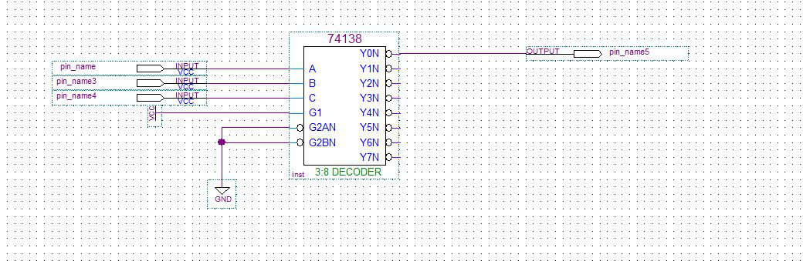
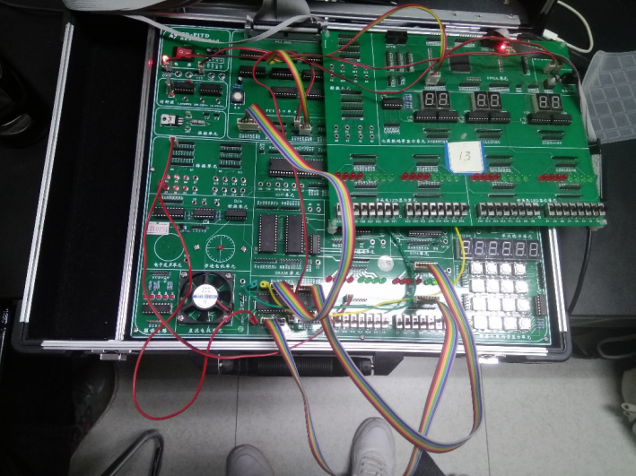
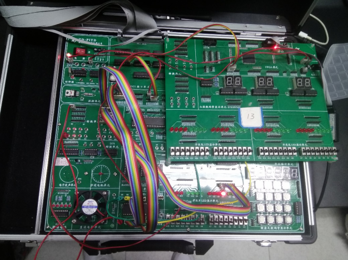
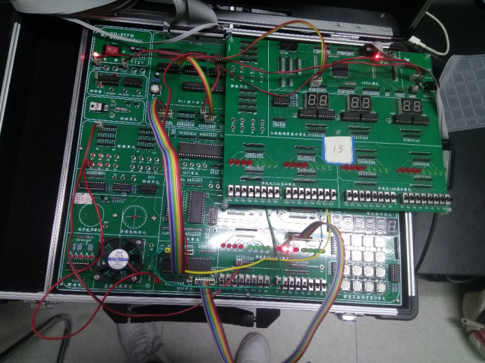

## 实验3：可编程接口芯片8255A的使用

### 实验电路

#### 实验译码电路如下



#### 实验电路连接及结果展示

##### 地址译码部分（以下实验的固定部分）：将实验箱上的地址总线A3-A5接到JATG 芯片作为输入，将芯片的输出经过转换单元接到实验箱8255的CS处

#### 实验一、二线路

##### 运用固定部分的接法接好8255的CS后，将实验箱CPU的数据总线D0-D7接到8255的D0-D7的数据口，将CPU的地址总线A1、A2接到8255的A0、A1处，并将CPU的IOW、IOR接到8255的IOW、IOR处，之后将8255的PA0-PA7与手动开关连接起来，将8255的PB0-PB7与LED灯连接起来即可



#### 实验三,四电路

##### 在实验一、二接线的基础上，去掉8255的A、B口连线，将PA0-PA7接至实验箱左侧转换模块，这样就可以将A口的数据同时传给B口和LED模块，所以将LED模块和B口与A口连接的转换模块的对应列集合相连即可



#### 实验五,六电路

##### 在实验一、二连线的基础上，去掉8255的A、B口连线，将C口连接至LED灯模块即可



### 实验代码

####实验3的代码：

```c
#include<stdio.h>  
#include<stdlib.h>  
#include<conio.h>  
#include<bios.h>  
#include<ctype.h>  
#include<process.h>  
//根据查看配置信息修改下列符号值***********************************  
#define IOY0    0x3000  
//*****************************************************************  
#define MY8255_A    IOY0+0x00*2  
#define MY8255_B    IOY0+0x01*2  
#define MY8255_C    IOY0+0x02*2  
#define MY8255_MODE IOY0+0x03*2  
void main()  
{  
    int a,i,j;  
    char  buff[9];  
    char  outdata[8]={0x1,0x2,0x4,0x8,0x10,0x20,0x40,0x80};   
    outp(MY8255_MODE,0x82);  
    while(true)  
    {  
        for(i=0;i<8;i++)  
        {  
            for(j=0;j<1000;j++)  
            {  
                outp(MY8255_A,outdata[i]);  
            }  
            for(j=0;j<1000;j++)  
            {  
                a = inp(MY8255_B);  
            }  
            itoa(a,buff,2);  
            printf("%08s\n",buff);  
        }  
    }  
}
```

#### 实验4代码

##### 其余代码与实验3相同,需要做的只是方式控制以及输出输入端口的变更

```c
outp(MY8255_MODE,0x90);  
    while(true)  
    {  
        for(i=0;i<8;i++)  
        {  
            for(j=0;j<1000;j++)  
            {  
                outp(MY8255_B,outdata[i]);  
            }  
            for(j=0;j<1000;j++)  
            {  
                a = inp(MY8255_A);  
            }  
            itoa(a,buff,2);  
            printf("%08s\n",buff);  
        }  
    }
```

#### 实验5代码

```c
1.outp(MY8255_MODE,0x82);  
2.    while(true)  
3.    {  
4.        for(i=0;i<8;i++)  
5.        {  
6.            for(j=0;j<20000;j++)  
7.            {  
8.                outp(MY8255_C,outdata[i]);  
9.            }  
10.        }  
    }
```

#### 实验6代码

```c
void main()  
{  
    int a,i,j;  
    char  buff[9];  
    char  outdata[8]={0x1,0x0,0x5,0x4,0x9,0x8,0xD,0xC,0x3,0x2,0x7,0x6,0xB,0xA,0xF,0xE};   
    outp(MY8255_MODE,0x82);  
    while(true)  
    {  
        for(i=0;i<8;i++)  
        {  
            for(j=0;j<10000;j++)  
            {  
                outp(MY8255_MODE,outdata[i]);  
            }  
        }  
    }  
}      
```

