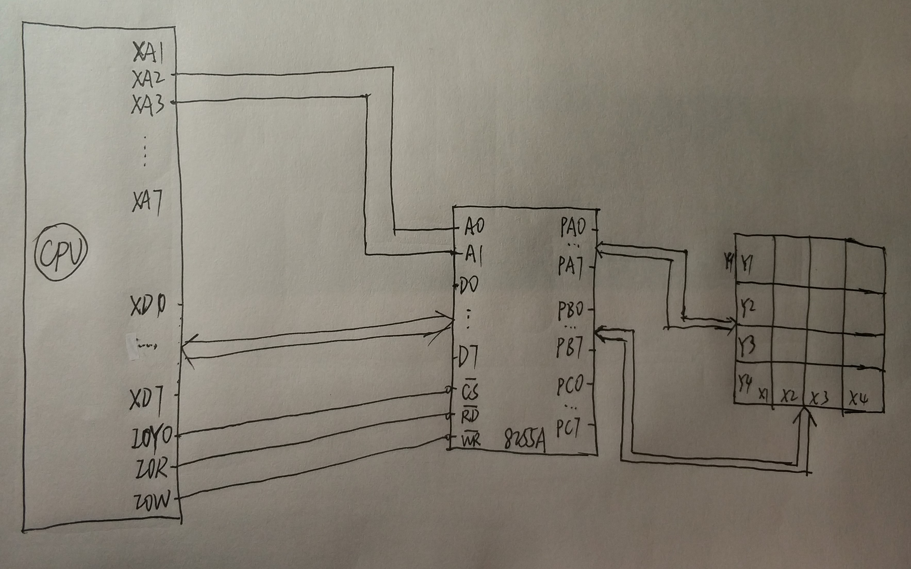
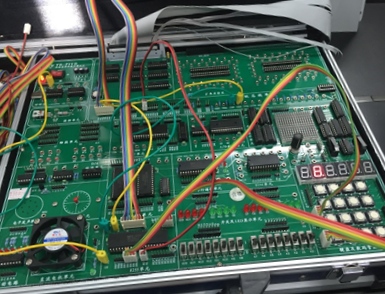

# 实验4：4×4 小键盘的使用

> 小组成员:吕建瑶1811400,郑佶1811464,吴京1811440

## 实验内容

1. 用 8255A 作接口,用行扫描法识别闭合键.要求程序编成循环结构,不按键时无输出,按下某个键,将其对应的字符显示出来,并且只显示一次.
2. 了解行反转法编程要点.

## 程序代码

```c
#include <stdio.h>
#include <stdlib.h>
#include <conio.h>
#include <bios.h>
#include <ctype.h>
#include <process.h>

void dis(void);
void key(void);
void clear(void);
void ccscan(void);
void putbuf(void);
void getkey(void);
void delay(int time);

//****************根据查看配置信息修改下列符号值*******************
#define  IOY0         0x3000
//*****************************************************************
#define  MY8255_A     IOY0 + 0x00*2
#define  MY8255_B     IOY0 + 0x01*2
#define  MY8255_C     IOY0 + 0x02*2
#define  MY8255_MODE  IOY0 + 0x03*2

char a[] = {0x3f, 0x06, 0x5b, 0x4f, 0x66, 0x6d, 0x7d, 0x07, 0x7f, 0x6f, 0x77, 0x7c, 0x39, 0x5e, 0x79, 0x71};
char b[] = {0x00, 0x00, 0x00, 0x00, 0x00, 0x00};
int  cc;
int  b_n;
int  n;

void main()
{
	outp(MY8255_MODE, 0x81);
	b_n = 5;

	while(1)
	{
		dis();
		clear();
		ccscan();
		if (cc)
		{
			dis();
			delay(0x100);
			delay(0x100);
			clear();
			ccscan();
			if (cc)
			{
				getkey();
			}
		}
		key();
	}
}

void getkey(void)
{
	int i;
	int j = 0xfe;

	for(i=0;i<=3;i++)
	{
		outp(MY8255_A, j);

		if ( !( (inp(MY8255_C)) & 0x01) )
		{
			n = i + 0;
			putbuf();
			return;
		}

		if ( !( (inp(MY8255_C)) & 0x02) )
		{
			n = i + 4;
			putbuf();
			return;
		}

		if ( !( (inp(MY8255_C)) & 0x04) )
		{
			n = i + 8;
			putbuf();
			return;
		}

		if ( !( (inp(MY8255_C)) & 0x08) )
		{
			n = i + 12;
			putbuf();
			return;
		}

		j <<= 1;
	}
}

void ccscan(void)
{
	outp(MY8255_A, 0x00);
	cc = inp(MY8255_C);
	cc = (~cc) & 0x0F;
}

void dis(void)
{
	int i;
	int j = 0xdf;

	for(i=0;i<=5;i++)
	{
		outp(MY8255_A, j);
		outp(MY8255_B, a[b[i]]);

		delay(0x100);
		j >>= 1;
		j |= 0x80;
	}
}

void clear(void)
{
	outp(MY8255_B, 0x00);
}

void putbuf(void)
{
	b[b_n] = n;
	b_n--;
	if (b_n == -1)
	{
		b_n = 5;
	}

	dis();
	clear();
	ccscan();
	while (cc)
	{
		dis();
		clear();
		ccscan();
	}
}

void key(void)
{
	if (bioskey(1) != 0)
	{
		exit(0);
	}
}

void delay(int time)
{
	int i;
	int j;
	for(i=0;i<=time;i++)
	{
		for(j=0;j<=0x100;j++)
		{   }
	}
	return;
}
```

## 抽象接线图



## 实验连线图


