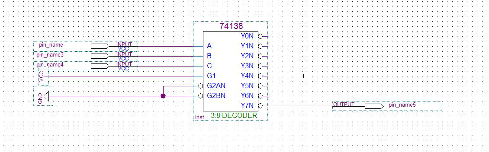
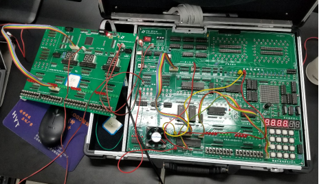
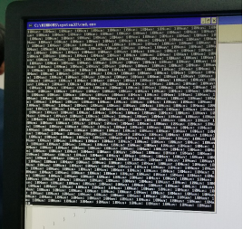

## 实验4: 4X4小键盘的使用

### 实验电路

#### 实验译码电路如下



### 实验电路连接及结果展示

#### 电路连接方法:

##### 将实验箱上的地址总线A3-A5接到JATG芯片作为输入，将芯片的输出经过转换单元	接到实验箱8255的CS处。将实验箱CPU的数据总线D0-D7接到8255的D0-D7的	数据口，将CPU的地址总线A1、A2接到8255的A0、A1处，并将CPU的IOW、	IOR接到8255的IOW、IOR处。将8255的A口的A0-A3与实验箱上的X1-X4连接起	来，作为行扫描的输入（对于CPU为输出）；将8255的B口B0-B3与实验箱上的Y1-	Y4连接起来作为行扫描的输出（对于CPU为输入）即可

#### 结果及电路展示






####实验程序代码：

#### 实验1代码

```c
#include<stdio.h>  
#include<stdlib.h>  
#include<conio.h>  
#include<bios.h>  
#include<ctype.h>  
#include<process.h>  
//根据查看配置信息修改下列符号值***********************************  
#define IOY0    0x3038  
	//*****************************************************************  
#define MY8255_A    IOY0+0x00*2  
#define MY8255_B    IOY0+0x01*2  
#define MY8255_C    IOY0+0x02*2  
#define MY8255_MODE IOY0+0x03*2  
void main()
{
    char output[4] = {0x07,0x0b,0x0d,0x0e};
    int i,num;
    char input;
    outp(MY8255_MODE,0x82);
    while(true)
    {
        for(i=0;i<4;i++)
        {
            outp(MY8255_A,output[i]);
            input = inp(MY8255_B);
            if(input&0x0f != 0x0f)
            {
                switch(input)
                {
                    case 0x07:
                        num = i*4;
                        break;
                    case 0x0b:
                        num = i*4+1;
                      	break;
                    case 0x0d:
                        num = i*4+2;
                        break;
                    case 0x0e:
                        num = i*4+3;
                        break;
                    default:
                        break;
                }
                printf("Num:%d",num);
            }
        }
    }
}     
```
