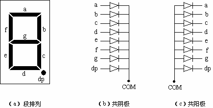
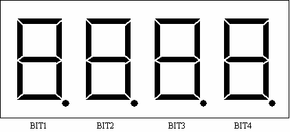
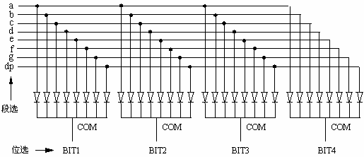
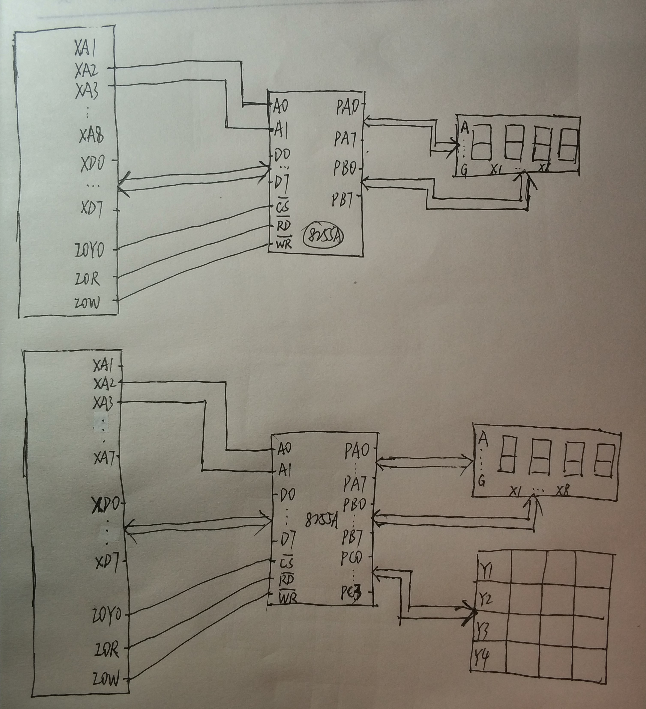
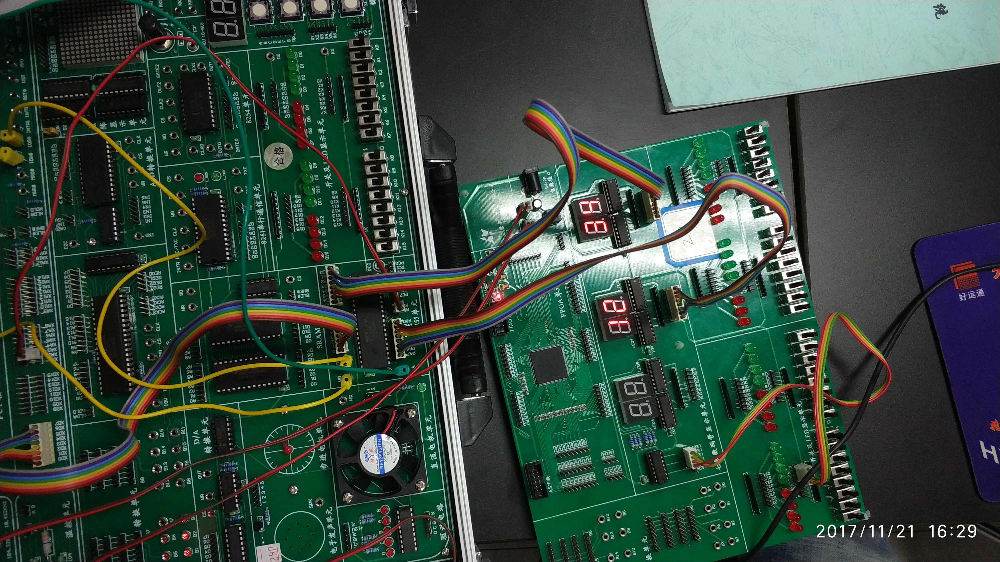

# 实验5：七段数码管的使用

> 小组成员:吕建瑶1811400,郑佶1811464,吴京1811440

## 1. 实验目的

1. 认识多位七段数码管；
2. 学会用软件方法进行段选和位选（称为动态显示）。

## 2. 实验背景

在单片机等小型应用系统以及仪器仪表中，经常使用七段数码管或十六段数码管，以前者居多。七段数码管由七条发光线段组成，它们排列成“日”字形，各段依次记为 a、b、c、d、e、f、g，另外还有一个小数点，记为 dp，如下图（a）所示。每条发光线段（或点）是一个发光二极管，可以排列成共阴极或共阳极形式，如下图（b）（c）所示。



一个七段数码管可显示一位十进制数码，而通常的显示一般需要若干位。为了减少电路板上的连线，一些制造商将若干个原本独立的七段数码管封装在一起并在内部进行了一些连接。下图是一种 4 位结构：



下图表示了其内部连接：



这种数码管在内部将各位相同位置的段连在一起，并引出，称为段选信号；4 个公共端分别引出，以进行位选择，称为位选信号。对于这种数码管，通常采用软件方法进行段选和位选。基本做法是，每次选择一位，在送位选信号的同时，提供该位的段选信号，于是该位被“点亮”，接着进行下一位。由于存在“余辉”，所以只要按一定周期，对各位依次进行操作，就会看到 4 个数码管同时被“点亮”。这种显示称为**动态显示**。显然，动态显示软件开销较大（需要周期性对各位操作，一旦周期打乱或者周期时间过长，显示将变得不稳定或闪烁）。与此相对应，还有另一种方法，称为**静态显示**。对于静态显示，每位数码管是独立的。需要为每个数码管配备一个 BCD-七段译码器/驱动器（为了方便编程，送往数码管显示的数据一般采用 BCD 码），为每两位（十进制）数码显示配备一个字节型输出端口用于 BCD 码的输出和锁存（寄存），因此硬件开销比较大。静态显示的优点是编程方便，因为一次输出将长久起作用，不需要象动态显示那样——周期性对各位操作。在多数小型应用系统中，从降低硬件成本考虑，一般采用动态显示。

## 3. 实验内容

1. 手动位选和段选：将手动数字量输入模块的引脚接七段数码管显示模块的相应引脚，拨动用于位选和段选的开关，观察数码管的显示内容。
2. 程序位选和段选：用 8255A 作接口（端口使用自行确定，最好和键盘矩阵所用端口不要重复），通过程序在数码管上显示一个 4 位十进制数（数据自定）。
3. 和 4×4 键盘矩阵结合：在 4×4 键盘矩阵上按一个键（0～9），将该键对应的编号（0～9）在最低位数码管上显示出来（原有的显示被去掉）。要求编成循环结构，上述操作可重复进行。按非数字键，程序退出。
4. （选做）在实验③的基础上改进：在 4×4 键盘矩阵上按一个键（0～9），将原有的显示向左移一位，新输入的按键编号（0～9）在最低位数码管上显示出来；按“B”键原有显示向右移一位，最高位补 0 或不显示；按其他键程序退出。

## 4. 译码电路


## 5. 程序代码

```c
//2.c
#include <stdio.h>
#include <stdlib.h>
#include <conio.h>
#include <bios.h>
#include <ctype.h>
#include <process.h>

void key(void);

//****************根据查看配置信息修改下列符号值*******************
#define  IOY0         0x3000
//*****************************************************************
#define  MY8255_A     IOY0 + 0x00*2
#define  MY8255_B     IOY0 + 0x01*2
#define  MY8255_C     IOY0 + 0x02*2
#define  MY8255_MODE  IOY0 + 0x03*2

void main()
{
	int a = 18, b = 52;

	outp(MY8255_MODE, 0x80);
	
	while(1)
	{
		
		outp(MY8255_A, a);
		outp(MY8255_B, b);
		key();
	}
}

void key(void)
{
	if (bioskey(1) != 0)
	{
		exit(0);
	}
}
```

```c
//3.c
#include <stdio.h>
#include <stdlib.h>
#include <conio.h>
#include <bios.h>
#include <ctype.h>
#include <process.h>

void dis(void);
void key(void);
void clear(void);
void ccscan(void);
void putbuf(void);
void getkey(void);
void delay(int time);

//****************根据查看配置信息修改下列符号值*******************
#define  IOY0         0x3000
//*****************************************************************
#define  MY8255_A     IOY0 + 0x00*2
#define  MY8255_B     IOY0 + 0x01*2
#define  MY8255_C     IOY0 + 0x02*2
#define  MY8255_MODE  IOY0 + 0x03*2

char a[] = {0x3f, 0x06, 0x5b, 0x4f,
			0x66, 0x6d, 0x7d, 0x07,
			0x7f, 0x6f, 0x77, 0x7c,
			0x39, 0x5e, 0x79, 0x71};
			
char m[] = {0, 1, 2, 3, 4, 5, 6, 7, 8, 9}; 
			
char b[] = {0x00, 0x00, 0x00, 0x00, 0x00, 0x00};
int  cc;
int  b_n=0;
int  n;

void main()
{
	outp(MY8255_MODE, 0x81);
	b_n = 5;
	
	while(1)
	{
		dis();
		clear();
		ccscan();
		if (cc)
		{
			dis();
			delay(0x100);
			delay(0x100);
			clear();
			ccscan();
			if (cc)
			{
				getkey();
			}
		}
		key();
	}
}

void getkey(void)
{
	int i;
	int j = 0xfe;
		char buff[12];
	for(i=0;i<=3;i++)
	{
		outp(MY8255_A, j);
		
	
		itoa(j, buff, 2);
		
		printf("j: %s\n", buff);
		if ( !( (inp(MY8255_C)) & 0x01) )
		{
			n = i + 0;
			putbuf();
			return;
		}
		
		if ( !( (inp(MY8255_C)) & 0x02) )
		{
			n = i + 4;
			putbuf();
			return;
		}
		
		if ( !( (inp(MY8255_C)) & 0x04) )
		{
			n = i + 8;
			putbuf();
			return;
		}
		
		if ( !( (inp(MY8255_C)) & 0x08) )
		{
			n = i + 12;
			putbuf();
			return;
		}
		
		j <<= 1;
	}
}

void ccscan(void)
{
	outp(MY8255_A, 0x00);
	cc = inp(MY8255_C);
	cc = (~cc) & 0x0F;
	//printf("cc: %d\n", cc);
}

void dis(void)
{
	int i;
	int j = 0xdf;
	char buff[12];
	outp(MY8255_A, j);
	if(b[0] > 9)
		exit(0);
	outp(MY8255_B, m[b[0]]);
	itoa(a[b[i]], buff, 2);
	printf("\t%s\t\n", buff);
	
	delay(0x100);
	j >>= 1;
	j |= 0x80;
}

void clear(void)
{
	outp(MY8255_B, 0x00);
}

void putbuf(void)
{
	b[0] = n;
	b_n--;
	if (b_n == -1)
	{
		b_n = 5;
	}
	
	dis();
	clear();
	ccscan();
	while (cc)
	{
		dis();
		clear();
		ccscan();
	}
}

void key(void)
{
	if (bioskey(1) != 0)
	{
		exit(0);
	}
}

void delay(int time)
{
	int i;
	int j;
	for(i=0;i<=time;i++)
	{
		for(j=0;j<=0x100;j++)
		{   }
	}
	return;
}
```

## 6. 系统接线图



## 7. 实验连线图

