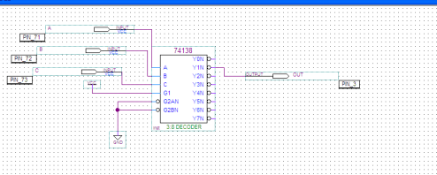
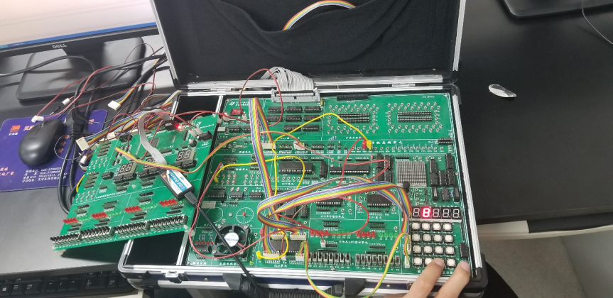
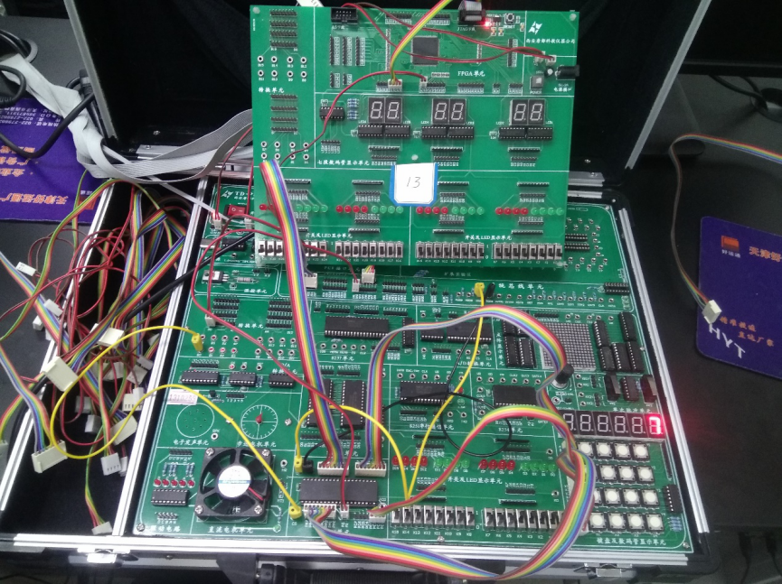

## 实验5: 七段数码管的使用

### 实验电路

#### 实验译码电路如下



### 实验电路连接及结果展示

#### 实验1电路连接方法:

##### 将段选A-G、dp与位选X1-X6接到手动输入开关接口


#### 实验1电路连接方法:

##### 将段选A-G、dp与位选X1-X6接到手动输入开关接口


#### 实验2电路连接方法:

##### 将实验箱上的地址总线A3-A5接到JATG芯片作为输入，将芯片的输出经过转换单元接到实验箱8255的CS处。将实验箱CPU的数据总线D0-D7接到8255的D0-D7的数据口，将CPU的地址总线A1、A2接到8255的A0、A1处，并将CPU的IOW、IOR接到8255的IOW、IOR处。将A口接数码管的位选，B口接数码管的段选即可



#### 实验3电路连接方法:

##### 在实验②的基础上将小键盘的输出Y1-Y4接到8255的C0-C3即可



####实验程序代码：

#### 实验3代码

```c
#include <stdio.h>  
#include <stdlib.h>  
#include <conio.h>  
#include <bios.h>  
#include <ctype.h>  
#include <process.h>  
//****************根据查看配置信息修改下列符号值*******************  
#define  IOY0         0x3010  
//*****************************************************************  
#define  MY8255_A     IOY0 + 0x00*2  
#define  MY8255_B     IOY0 + 0x01*2  
#define  MY8255_C     IOY0 + 0x02*2  
#define  MY8255_MODE  IOY0 + 0x03*2  
  
void main()  
{  
    char choose_bit[6]={0xFE,0xFD,0xFB,0xF7,0xEF,0xDF};  
    char show_num[11]={0x3F,0x06,0x5B,0x4F,0x66,0x6D,0x7D,0x07,0x7F,0x6F,0};  
    unsigned int temp,i,row,judge,result,j,col,n=0,flag;  
    char a[4] = {0x07,0x0B,0x0D,0x0E};  
    char b[4] = {0xdf,0xef,0xf7,0xfb};  
    outp(MY8255_MODE,0X89);  
    flag=0;  
    while(1)  
    {  
        while(1)  
        {  
            if(flag){  
            for(j=0;j<10000;j++){  
                outp(MY8255_A, choose_bit[0]);  
                outp(MY8255_B,show_num[n]);  
            }  
            }  
            for(i=0;i<4;i++)  
            {  
            outp(MY8255_A,b[i]);  
            row = inp(MY8255_C);  
            col=i;  
            //if(row != 15)  
            //printf("y:%d",row);  
            if(row!=0xf)  
            {  
                flag++;  
                break;  
            }  
            }  
             if(row!=0xf)  
            {  
                break;   
            }  
        }  
              
        if(n>9)  
        {  
            return;  
        }  
        for(i=0;i<4;i++)  
        {  
                if(row==a[i])  
                {  
                    printf("x:%d",col);  
                    printf("y:%d",i);  
                    n=col+i*4;  
                    for(j=0;j<10000;j++){  
                        outp(MY8255_A, choose_bit[0]);  
                        outp(MY8255_B,show_num[n]);  
                    }  
                    printf(" %x",n);  
                    printf("\n");  
                    break;  
                }  
        }     
    }  
}     
```
