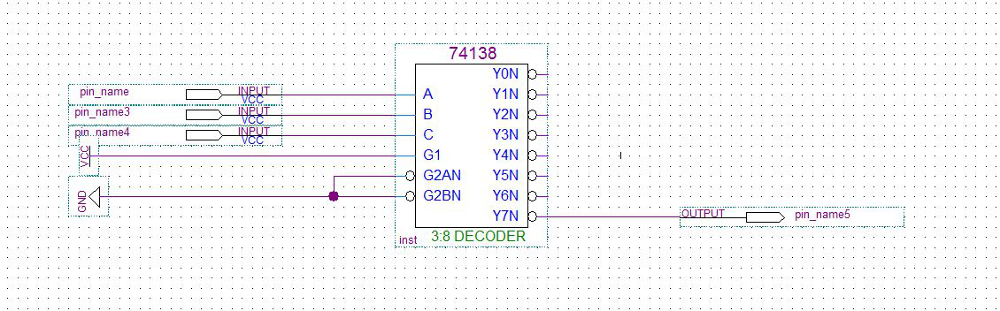
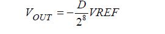
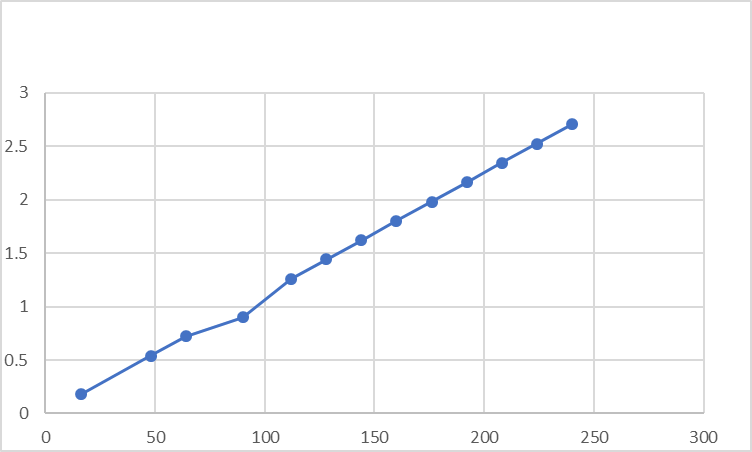

## 实验6: D/A转换器的使用

### 实验电路

#### 实验译码电路如下

### 输出电压和转换数据间成正比

##### 根据

##### 可得

#### 实验数据及图像:

| 16   | 0.178 |
| ---- | ----- |
| 48   | 0.539 |
| 64   | 0.721 |
| 90   | 0.9   |
| 112  | 1.261 |
| 128  | 1.443 |
| 144  | 1.623 |
| 160  | 1.804 |
| 176  | 1.983 |
| 192  | 2.165 |
| 208  | 2.345 |
| 224  | 2.526 |
| 240  | 2.706 |

