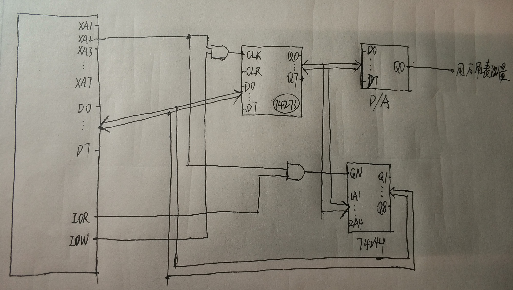
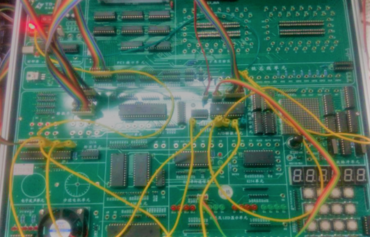
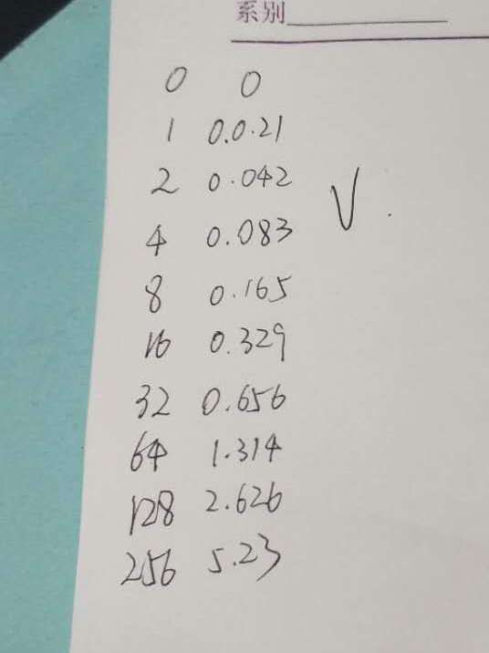

# 实验6：D/A 转换器的使用

> 小组成员:吕建瑶1811400,郑佶1811464,吴京1811440

## 实验内容

从[0,255]区间分别取数输入到 D/A 转换器中,用万用表测 D/A 转换器的输出.并根据测量结果画出输出电压和转换数据之间的转换关系.

## 程序代码

```c
#include <stdio.h>
#include <stdlib.h>
#include <conio.h>
#include <bios.h>
#include <ctype.h>
#include <process.h>

void key(void);
void delay(int time);

#define  IOY0         0x3000
#define  DA0832       IOY0 + 0x00*2

char ch1;

void main()
{
	while(1)
	{
		printf("high\n");
		ch1 = 0;//ch1从0~255取值
		outp(DA0832, ch1);
		delay(0x100);

		key();
	}
}

void key(void)
{
	if (bioskey(1) != 0)
	{
		exit(0);
	}
}

void delay(int time)
{
	int i;
	int j;
	for(i=0;i<=time;i++)
	{
		for(j=0;j<=0xf000;j++)
		{   }
	}
	return;
}
```

## 系统接线图



## 实验连线图




