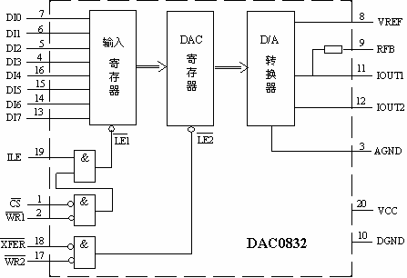
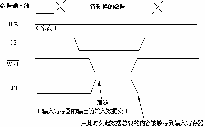
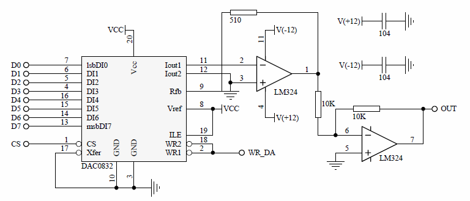
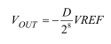

# 实验6：D/A 转换器的使用

> 小组成员:吕建瑶1811400,郑佶1811464,吴京1811440

## 1. 实验目的

了解 D/A 转换器的外部特性，学会使用 D/A 转换器。

## 2. 实验背景

D/A 转换器，即将数字量变成模拟量的转换器，也是计算机本身及应用系统中的常用电路。例如，在声卡中就用到 D/A 转换器，将数字信号变成音频电压信号。有了 D/A 转换器，计算机就可以实现各种控制，如对生产过程进行控制。D/A 转换器也早已集成化，种类、型号也非常多。本实验系统中安排了一片 DAC0832。这是用 CMOS 工艺制成的 8 位精度的 D/A转换芯片，它所接收的待转换的数字量为二进制 8 位（TTL 电平）。转换成的模拟量是电流，电流建立时间为 1μs，若要变成与数字量对应的电压，需要外接一个运算放大器（简称运放）。

为了理解 DAC0832 的连接，有必要看一下它的内部结构框图。



DAC0832 由四个部分所组成：输入寄存器、DAC 寄存器、D/A 转换器和输入控制逻辑。这是一种两级数据缓冲结构。当数据进到第二级，便进行 D/A 转换。之所以这样安排，是考虑到一种特殊需要：一个系统中使用多片 D/A 芯片，要求各芯片同时开始进行 D/A 转换，时间上严格保持一致（可称为同步转换）。这时，把第二级控制信号都连在一起，需转换时先让各待转换数据依次（按程序的执行顺序）写入对应 D/A 芯片的第一级寄存器，然后发一个命令，使各 D/A 芯片的第一级寄存器的内容同时进入到第二级，因而同时开始 D/A 转换。

图中内部信号 LE1#和 LE2#为锁存允许（Latch Enable）。为高时，寄存器为跟随状态，即输出随输入的变化而变化；变低的瞬间，输入端的状态被锁存到寄存器中。

ILE、CS#和 WR1#为第一级缓冲控制。ILE（Input Latch Enable）为输入锁存允许，高有效，一般接高。CS#为芯片的片选，低有效。WR1#为写信号 1，低有效。下面是第一级缓冲控制的时序图。



图中已表示出信号的配合及作用。可将该时序关系简述为：当 CS#和 WR1#同时有效时，待转换的数据被锁存到输入寄存器。

XFER#和 WR2#为第二级缓冲控制。XFER#为传输控制信号（Transfer Control Signal），低有效。WR2#为写信号 2，低有效。LE2#的产生逻辑和 LE1#基本相同。所以，其时序关系可简述为：当 XFER#和 WR2#同时有效时，输入寄存器中的内容被锁存到 DAC 寄存器，随即开始 D/A 转换。

实验板中 D/A 转换模块的电路连接如下图所示。



图中，左上角是基准电压（VREF）产生电路。其原理和 A/D 转换所需的基准电压产生电路相似，但有两点不同：一是供电电压这里是－12V,二是稳压二极管的极性变了。因此这里产生的基准电压是负值。

图中 LM324 是通用运算放大器。按照图中的接法，该运算放大器的输出的电压值与 D/A转换数据成正比，具体如下式所示：

这里，D 是待转换的数字量，除以 2 的 8 次方是因为转换的数字量为二进制 8 位。

## 3. 实验内容

从[0,255]区间分别取数输入到 D/A 转换器中，用万用表测 D/A 转换器的输出。并根据测量结果画出输出电压和转换数据之间的转换关系。

## 4. 译码电路

## 5. 程序代码

```c
#include <stdio.h>
#include <stdlib.h>
#include <conio.h>
#include <bios.h>
#include <ctype.h>
#include <process.h>

void key(void);
void delay(int time);

#define  IOY0         0x3000
#define  DA0832       IOY0 + 0x00*2

char ch1;

void main()
{
	while(1)
	{
		printf("high\n");
		ch1 = 0;//ch1从0~255取值
		outp(DA0832, ch1);
		delay(0x100);
		
		key();
	}
}

void key(void)
{
	if (bioskey(1) != 0)
	{
		exit(0);
	}
}

void delay(int time)
{
	int i;
	int j;
	for(i=0;i<=time;i++)
	{
		for(j=0;j<=0xf000;j++)
		{   }
	}
	return;
}
```

## 6. 系统接线图


## 7. 实验连线图


