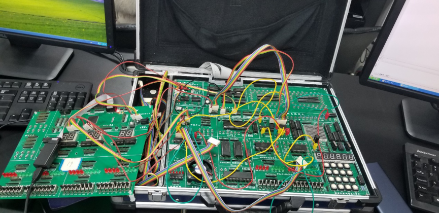

## 实验7: A/D转换器的使用

### 实验电路

#### 地址端口安排

##### 74138的三个输入分别接CPU的A1、A2、A3，74138的Y0接AD转换器的CS，Y1用于查询法时读入EOC，Y2接DA转换器的CS。此外，用Y3的地址代表设置AD转化器A、B、C的地址，用CPU数据D8-D10设置AD转换器的通道地址

#### 地址

##### AD转换器：0x3000、EOC地址：0x3002、DA转换器：0x3004、AD转换器通道地址：0x3006

#### 线路接法

##### 将CPU的A1-A3接到JATG芯片的输入，将芯片的输出引脚经转换单元分别接AD、DA的CS。将AD的EOC经转换单元后作为芯片的输入，芯片的输出接到CPU的D0上。将CPU的IOW、IOR、CLK分别接到AD、DA的WR、RD、CLK。将DA的D0-D7、AD的D0-D7、以及AD的ABC接到CPU的数据总线上。AD转换器的INT0输入在第二个实验为实验箱上的电压旋钮，第三个实验为DA的OUT



### 实验程序代码：

#### 实验2代码

##### 查询法

```c
#include<stdio.h>  
#include<stdlib.h>  
#include<conio.h>  
#include<bios.h>  
#include<ctype.h>  
#include<process.h>  
//根据查看配置信息修改下列符号值***********************************  
#define IOY0    0x3000  
//*****************************************************************  
#define AD  IOY0+0x00*2  
#define EOC IOY0+0x01*2  
#define DA  IOY0+0x02*2  
#define AD_TRANS IOY0+0x03*2  
void main()  
{  
    char eoc,num;  
    while(true)  
    {  
        outp(AD_TRANS,0x0);//选择INT0  
        outp(AD,0x0);   //启动转换  
        eoc=inp(EOC);  
        if((eoc&0x1))  //如果eoc为1，转换结束  
        {  
            num=inp(AD);  
            printf("%d\n",(int)num);  
        }  
    }  
}
```

##### 定时法

```c
#include<stdio.h>  
#include<stdlib.h>  
#include<conio.h>  
#include<bios.h>  
#include<ctype.h>  
#include<process.h>  
void delay(int time)  
//根据查看配置信息修改下列符号值***********************************  
#define IOY0    0x3000  
//*****************************************************************  
#define AD  IOY0+0x00*2  
#define EOC IOY0+0x01*2  
#define DA  IOY0+0x02*2  
#define AD_TRANS IOY0+0x03*2  
void main()  
{  
    char num;  
    while(true)  
    {  
        outp(AD_TRANS,0x0);//选择INT0  
        outp(AD,0x0);   //启动转换  
        delay(10000);  
        num=inp(AD);  
        printf("%d\n",(int)num);  
    }  
}             
void delay(int time)  
{  
    int i;  
    int j;  
    for(i=0;i<=time;i++)  
    {  
        for(j=0;j<=0x7000;j++)  
        {   }  
    }  
    return;  
}    
```

##### 实验3代码

```c
#include<stdio.h>    
#include<stdlib.h>    
#include<conio.h>    
#include<bios.h>    
#include<ctype.h>    
#include<process.h>    
//根据查看配置信息修改下列符号值***********************************    
#define IOY0    0x3000    
//*****************************************************************    
#define AD  IOY0+0x00*2    
#define EOC IOY0+0x01*2    
#define DA  IOY0+0x02*2    
#define AD_TRANS IOY0+0x03*2    
void main()    
{    
    char innum,eoc;    
    char outnum=0x10;    
    while(true)    
    {    
        outp(DA,outnum);    
        outp(AD_TRANS,0x0);//选择INT0    
        outp(AD,0x0);   //启动转换    
        eoc=inp(EOC);    
        while(!(eoc&0x1))   //出循环时转换完成    
        {    
            eoc=inp(EOC);    
        }    
        innum=inp(AD);    
        printf("%d\n",(int)innum);    
        outnum += 0x10;    
    }    
}               

```

