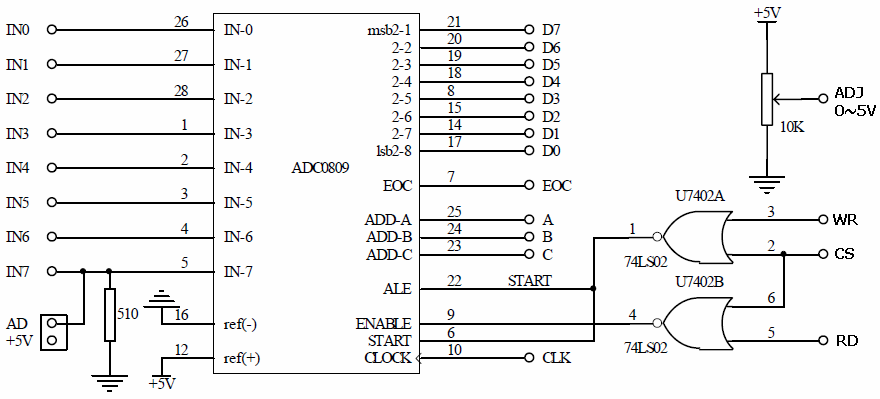
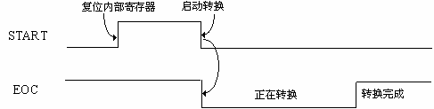
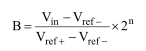
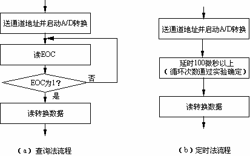

# 实验7：A/D 转换器的使用

> 小组成员:吕建瑶1811400,郑佶1811464,吴京1811440

## 1. 实验目的

1. 了解 A/D 转换器的外部特性，学会 A/D 转换器与用户总线接口电路的构成。
2. 学会对多通道 A/D 转换器编程，掌握查询和定时两种方法。

## 2. 实验背景

A/D 转换器，即将模拟量变成数字量的转换器，是计算机本身及应用系统中常用的电路。有了它，可以将各种模拟量采集到计算机中（对于非电模拟信号，需要先通过传感器或变送器变成电信号），进行数据处理、统计或决策，有时再通过 D/A 转换器和执行结构，实现对生产过程或被控对象的自动控制。A/D 转换器早已被集成化，并有多种类型。本实验系统中安排了一片 ADC0809，虽然简单，但颇具代表性。该转换器采用 CMOS 工艺制成，可分时转换 8 路（或者说成 8 个通道）模拟信号，其内部含有 8 选 1 模拟开关，转换时间为 100μs，转换精度为 8 位，即转换结果为 8 位二进制数字量。实验板中对 ADC0809 已进行了一些连接，并在一些引脚处安排了插孔，如下图所示。



图中，IN0～IN7 为模拟量输入。ADD C、ADD B 和 ADD A 为通道地址输入。内部的译码器对通道地址译码，选中对应的一路模拟量去进行 A/D 转换（ADD C、ADD B 和 ADD A 为 000时，选中 IN0，为 001 时，选中 IN1,其他组合依此类推）。

CLK 为时钟信号（A/D 转换需要在 CLK 的作用下用若干个 CLK 周期才得以完成），其频率（fC）的典型值为 640KHz,最大值为 1280KHz,最小值为 10KHz。请从实验箱选取符合要求的时钟频率。

ALE 为地址锁存允许信号，当它从低到高的跳变时将通道地址的输入锁存。

START 为启动信号，正脉冲有效，它的上升沿将内部寄存器复位（为转换作准备），下降沿启动 A/D 转换。

ADC0809 对 START 和 ALE 的脉冲宽度（高电平持续时间）的最小值（前者称为 TWS，后者称为 TWALE）有要求，并且要求相同：典型值为 100ns，最大值为 200ns。这就是说，这两个信号的脉冲宽度不能小于 100 ns，至少不能小于 200ns。

EOC 为转换结束标志。在转换期间 EOC 为低电平，一旦转换完毕，则变成高电平。EOC可作为查询信号，了解转换是否结束；也可以作为中断请求信号，在转换结束时由低到高的跳变提出中断请求。
EOC 和 START 的时序关系如下图所示。



D7～D0 为转换数据输出，内部有三态门，所以属于三态输出。OE 为输出允许，高电平有效，有效时打开内部输出三态门，使转换结果（8 位二进制数）出现在对外的数据线上。

在第一幅图的右下方是基准电压（VREF+）产生电路。根据 A/D 转换原理，模拟输入信号Vin 与转换结果 B（二进制数）有下面的关系：

对 A/D 转换器的编程可采用查询法或定时法。对一个通道进行 A/D 转换，两种方法的流程分别见图 3.3 中的（a）和（b）。



## 3. 实验内容

1. 构建 ADC0809 与 CPU 总线间的接口电路。
2. 用查询法和定时法分别采集 8 个通道的 A/D 转换读数（又称采样值），并转换成对应的电压，将结果显示出来。(各通道的输入电压自定义,可接地或者 Vcc)
3. 选取若干个数进行 D/A 转换，再通过 ADC0809 的某个通道进行循环采集和转换，并将结果显示出来。

## 4. 译码电路

## 5. 程序代码

```c
//2-1.c
#include <stdio.h>
#include <stdlib.h>
#include <conio.h>
#include <bios.h>
#include <ctype.h>
#include <process.h>

void key(void);
void delay(int time);

//****************根据查看配置信息修改下列符号值*******************
#define  IOY0       0x3000
//*****************************************************************
#define  AD0809     IOY0 + 0x00*2
int i;
char a[] = {"AD0809 IN0: "};

void main()
{
	int data;
	int datas[8];
	while(1)
	{
		//printf("%s", a);
		for(i=0;i<8;i++){
		outp(AD0809, 0x00+i);//
		delay(0x700);
		datas[i] = inp(AD0809);//AD0809读这个地址的值
		
		}
		for(i=0;i<8;i++){
	//	printf("%02X\r\n", datas[i]);
	printf("AD0809 IN%d: %d\n", i,datas[i]);
		}
		key();
	}
}

void key(void)
{
	if (bioskey(1) != 0)
	{
		exit(0);
	}
}

void delay(int time)
{
	int i;
	int j;
	for(i=0;i<=time;i++)
	{
		for(j=0;j<=0x7000;j++)
		{   }
	}
	return;
}    
```

```c
//2-2.c
#include <stdio.h>
#include <stdlib.h>
#include <conio.h>
#include <bios.h>
#include <ctype.h>
#include <process.h>

void key(void);
void delay(int time);

//*****************************************************************
#define  AD0809     0x3070  //0111 0000

#define  MY8255_A     0x30b0  //1011 0000
#define  MY8255_B     MY8255_A + 2
#define  MY8255_C     MY8255_A + 4
#define  MY8255_CMD   MY8255_A + 6
int i;
char a[] = {"AD0809 IN0: "};

void main()
{
	int data,eoc;
	int datas[8];
	outportb(MY8255_CMD,0x91);//A低四位输入
	while(1)
	{
		//printf("%s", a);
		for(i=0;i<8;i++){
			outp(AD0809, 0x00+i);
			//delay(0x700);
			//datas[i] = inp(AD0809);

			while(1){
				eoc=inp(MY8255_A);
				
				eoc=eoc&0x01;
				//printf("eoc:%d\n",eoc);
				if(eoc==0x01)
				{
					datas[i] = inp(AD0809);//AD0809读这个地址的值
					break;
				}
			}//while  
		}//for
		for(i=0;i<8;i++){
			printf("AD0809 IN%d: %d\n", i,datas[i]);
		}
		key();
	}
}

void key(void)
{
	if (bioskey(1) != 0)
	{
		exit(0);
	}
}

void delay(int time)
{
	int i;
	int j;
	for(i=0;i<=time;i++)
	{
		for(j=0;j<=0x7000;j++)
		{   }
	}
	return;
}    
```

```c
//3.c
#include <stdio.h>
#include <stdlib.h>
#include <conio.h>
#include <bios.h>
#include <ctype.h>
#include <process.h>

void key(void);
void delay(int time);

//*****************************************************************
#define  AD0809     0x3070  //0111 0000
#define  DA    0x30d0 //1101 0000
#define  MY8255_A     0x30b0  //1011 0000
#define  MY8255_B     MY8255_A + 2
#define  MY8255_C     MY8255_A + 4
#define  MY8255_CMD   MY8255_A + 6
int i;
char a[] = {"AD0809 IN0: "};

void main()
{
	int data,eoc;
	outportb(MY8255_CMD,0x93);//A输入,B输入
	while(1)
	{
			outp(AD0809, 0x00);
			while(1){
				eoc=inp(MY8255_A);
				
				eoc=eoc&0x01;
				if(eoc==0x01)
				{
					data= inp(AD0809);//AD0809读这个地址的值
					printf("IN0:%d\n",data);
					break;
				}
			}//while 
		delay(0x700); 
		key();
	}
	
}

void key(void)
{
	if (bioskey(1) != 0)
	{
		exit(0);
	}
}

void delay(int time)
{
	int i;
	int j;
	for(i=0;i<=time;i++)
	{
		for(j=0;j<=0x7000;j++)
		{   }
	}
	return;
}  
```

## 6. 系统接线图

## 7. 实验连线图

2-1:


2-2:


3:
