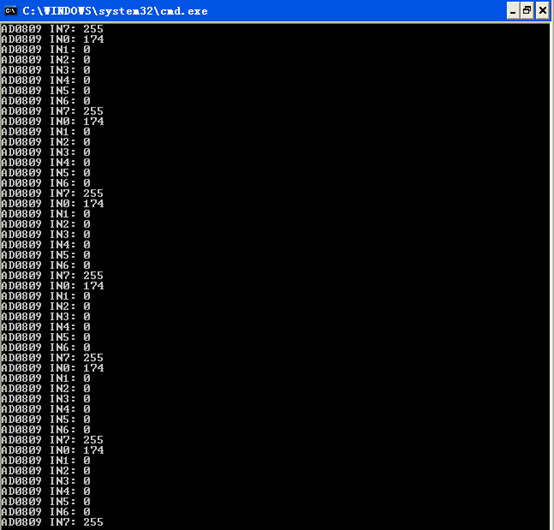
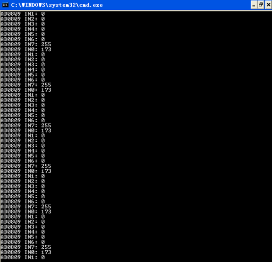
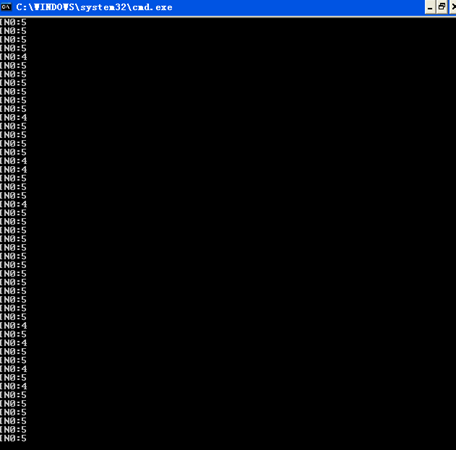

# 实验7：A/D 转换器的使用

> 小组成员:吕建瑶1811400,郑佶1811464,吴京1811440

## 实验内容

1. 构建 ADC0809 与 CPU 总线间的接口电路.
2. 用查询法和定时法分别采集 8 个通道的 A/D 转换读数（又称采样值）,并转换成对应的电压,将结果显示出来.(各通道的输入电压自定义,可接地或者 Vcc)
3. 选取若干个数进行 D/A 转换,再通过 ADC0809 的某个通道进行循环采集和转换,并将结果显示出来.

## 译码电路

## 程序代码

```c
//2-1.c
#include <stdio.h>
#include <stdlib.h>
#include <conio.h>
#include <bios.h>
#include <ctype.h>
#include <process.h>

void key(void);
void delay(int time);

//****************根据查看配置信息修改下列符号值*******************
#define  IOY0       0x3000
//*****************************************************************
#define  AD0809     IOY0 + 0x00*2
int i;
char a[] = {"AD0809 IN0: "};

void main()
{
	int data;
	int datas[8];
	while(1)
	{
		//printf("%s", a);
		for(i=0;i<8;i++){
		outp(AD0809, 0x00+i);//
		delay(0x700);
		datas[i] = inp(AD0809);//AD0809读这个地址的值
	
		}
		for(i=0;i<8;i++){
	//	printf("%02X\r\n", datas[i]);
	printf("AD0809 IN%d: %d\n", i,datas[i]);
		}
		key();
	}
}

void key(void)
{
	if (bioskey(1) != 0)
	{
		exit(0);
	}
}

void delay(int time)
{
	int i;
	int j;
	for(i=0;i<=time;i++)
	{
		for(j=0;j<=0x7000;j++)
		{   }
	}
	return;
}  
```

```c
//2-2.c
#include <stdio.h>
#include <stdlib.h>
#include <conio.h>
#include <bios.h>
#include <ctype.h>
#include <process.h>

void key(void);
void delay(int time);

//*****************************************************************
#define  AD0809     0x3070  //0111 0000

#define  MY8255_A     0x30b0  //1011 0000
#define  MY8255_B     MY8255_A + 2
#define  MY8255_C     MY8255_A + 4
#define  MY8255_CMD   MY8255_A + 6
int i;
char a[] = {"AD0809 IN0: "};

void main()
{
	int data,eoc;
	int datas[8];
	outportb(MY8255_CMD,0x91);//A低四位输入
	while(1)
	{
		//printf("%s", a);
		for(i=0;i<8;i++){
			outp(AD0809, 0x00+i);
			//delay(0x700);
			//datas[i] = inp(AD0809);

			while(1){
				eoc=inp(MY8255_A);
			
				eoc=eoc&0x01;
				//printf("eoc:%d\n",eoc);
				if(eoc==0x01)
				{
					datas[i] = inp(AD0809);//AD0809读这个地址的值
					break;
				}
			}//while  
		}//for
		for(i=0;i<8;i++){
			printf("AD0809 IN%d: %d\n", i,datas[i]);
		}
		key();
	}
}

void key(void)
{
	if (bioskey(1) != 0)
	{
		exit(0);
	}
}

void delay(int time)
{
	int i;
	int j;
	for(i=0;i<=time;i++)
	{
		for(j=0;j<=0x7000;j++)
		{   }
	}
	return;
}  
```

```c
//3.c
#include <stdio.h>
#include <stdlib.h>
#include <conio.h>
#include <bios.h>
#include <ctype.h>
#include <process.h>

void key(void);
void delay(int time);

//*****************************************************************
#define  AD0809     0x3070  //0111 0000
#define  DA    0x30d0 //1101 0000
#define  MY8255_A     0x30b0  //1011 0000
#define  MY8255_B     MY8255_A + 2
#define  MY8255_C     MY8255_A + 4
#define  MY8255_CMD   MY8255_A + 6
int i;
char a[] = {"AD0809 IN0: "};

void main()
{
	int data,eoc;
	outportb(MY8255_CMD,0x93);//A输入,B输入
	while(1)
	{
			outp(AD0809, 0x00);
			while(1){
				eoc=inp(MY8255_A);
			
				eoc=eoc&0x01;
				if(eoc==0x01)
				{
					data= inp(AD0809);//AD0809读这个地址的值
					printf("IN0:%d\n",data);
					break;
				}
			}//while 
		delay(0x700); 
		key();
	}

}

void key(void)
{
	if (bioskey(1) != 0)
	{
		exit(0);
	}
}

void delay(int time)
{
	int i;
	int j;
	for(i=0;i<=time;i++)
	{
		for(j=0;j<=0x7000;j++)
		{   }
	}
	return;
}  
```

## 系统接线图

## 实验连线图

2-1:


2-2:


3:

