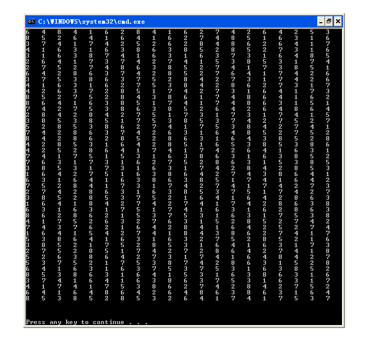
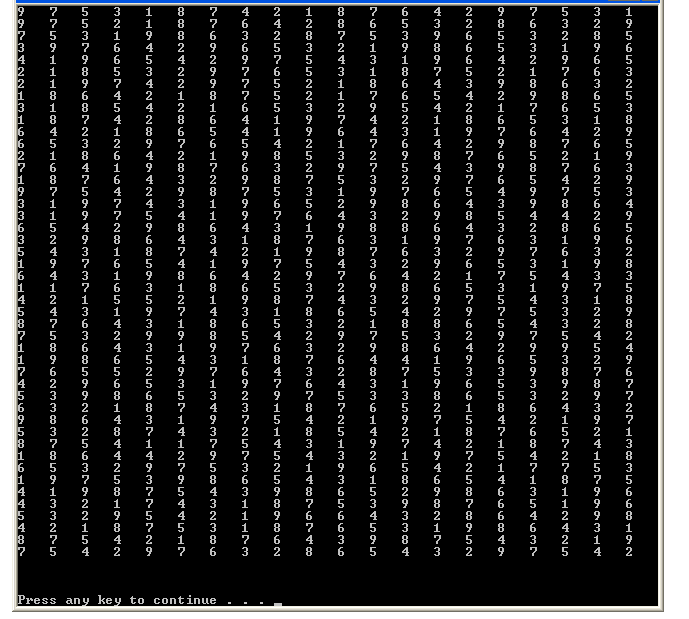
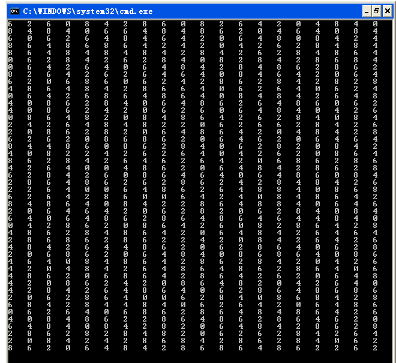
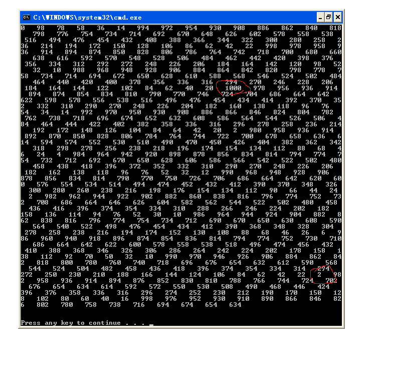
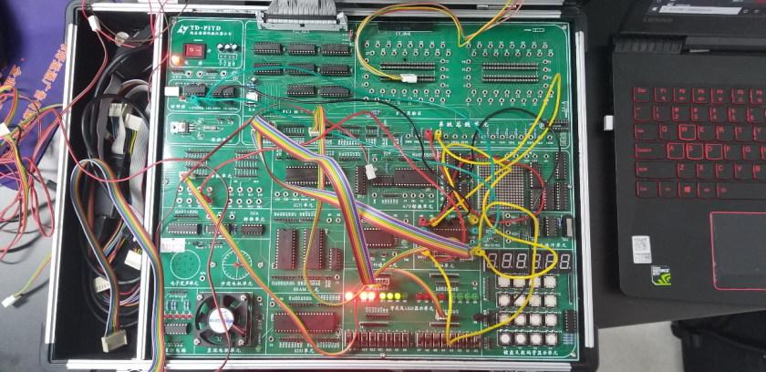
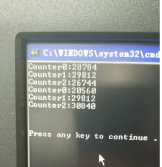
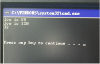

## 实验8: 可编程计数器/计时器8254的使用

### 说明实验1的计数规律

#### 随机出现以下数值:1,2,3,4,5,6,7,8



#### 随机出现以下数值:1,2,3,4,5,6,7,8,9



#### 随机出现以下数值:8,6,4,2


####随机出现以下数值:8,6,4,2,0



#### 范围为2-1000



#### 列出实验2所记录数据，并解释不同计数器之间的数据差异原因

### 实验电路连接

##### 将A1、A2分别接8254的A0、A1，并用A2-A4进行地址译码，地址译码结果接	8254的CS，8254的D口与CPU的D0-D7相连，将三个计数器的门控信号GATE	均置为1，连接IOR、IOW至8254对应RD、WR处，最后将CLK0、CLK1、CLK2分	别与实验箱左上角的时钟信号1.8432MHz、184.32kHz、18.432kHz相连即可完成连	线



####实验程序代码：

```c
//T8254-1.c  
//8254定时/计数器应用实验  输入1.8432MHz，输出1Hz  
  
#include <stdio.h>  
#include <stdlib.h>  
#include <conio.h>  
#include <bios.h>  
#include <ctype.h>  
#include <time.h>  
  
//***************根据查看配置信息修改下列符号值********************  
#define  IOY0              0x3000  
//*****************************************************************  
#define  MY8254_COUNT0     IOY0 + 0x00*2  
#define  MY8254_COUNT1     IOY0 + 0x01*2  
#define  MY8254_COUNT2     IOY0 + 0x02*2  
#define  MY8254_MODE       IOY0 + 0x03*2  
  
void main()  
{  
    int clk1,clk2;  
    int low,high,num;  
      
    outp(MY8254_MODE,0x30);  
    outp(MY8254_COUNT0,0xff);  
    outp(MY8254_COUNT0,0xff);  
      
    outp(MY8254_MODE,0x70);  
    outp(MY8254_COUNT1,0xff);  
    outp(MY8254_COUNT1,0xff);  
      
    outp(MY8254_MODE,0xB0);  
    outp(MY8254_COUNT2,0xff);  
    outp(MY8254_COUNT2,0xff);  
      
    clk1 = clock();  
    do  
    {  
        clk2=clock();  
    }while((clk2-clk1)<0.00182)//0.001s  
    outp(MY8254_MODE,0xDE);   
    low=inp(MY8254_COUNT0);  
    high=inp(MY8254_COUNT0);  
    num=high*256+low;  
    printf("Counter0:%d\n",num);  
      
    low=inp(MY8254_COUNT1);  
    high=inp(MY8254_COUNT1);  
    num=high*256+low;  
    printf("Counter1:%d\n",num);  
      
    low=inp(MY8254_COUNT2);  
    high=inp(MY8254_COUNT2);  
    num=high*256+low;  
    printf("Counter2:%d\n",num);  
      
    clk1=clock();  
    do  
    {  
        clk2=clock();  
    }while((clk2-clk1)<0.0182);//0.01s  
        outp(MY8254_MODE,0xDE);   
    low=inp(MY8254_COUNT0);  
    high=inp(MY8254_COUNT0);  
    num=high*256+low;  
    printf("Counter0:%d\n",num);  
      
    low=inp(MY8254_COUNT1);  
    high=inp(MY8254_COUNT1);  
    num=high*256+low;  
    printf("Counter1:%d\n",num);  
      
    low=inp(MY8254_COUNT2);  
    high=inp(MY8254_COUNT2);  
    num=high*256+low;  
    printf("Counter2:%d\n",num);  
} 
```

#### 结果输出



#### 结果分析

#####  不同计数器之间数据差异是时钟频率所导致的，因为CLK0=10CLK1,CLK1=10CLK2,所以原理上计数器0减小的数值为计数器1的10倍，计数器		1减小的数值为计数器2的十倍。实验数据中均在十倍左右，存在一定误差


### 实验三

#### 电路连接

##### 实验三连线只需将CLK0-CLK3改一下即可，即CLK0接实验箱的1.8432MHz，		CLK1接OUT0，CLK2接OUT1即可

#### 实验代码

```c
//T8254-1.c  
//8254定时/计数器应用实验  输入1.8432MHz，输出1Hz  
  
#include <stdio.h>  
#include <stdlib.h>  
#include <conio.h>  
#include <bios.h>  
#include <ctype.h>  
#include <time.h>  
  
//***************根据查看配置信息修改下列符号值********************  
#define  IOY0              0x3000  
//*****************************************************************  
#define  MY8254_COUNT0     IOY0 + 0x00*2  
#define  MY8254_COUNT1     IOY0 + 0x01*2  
#define  MY8254_COUNT2     IOY0 + 0x02*2  
#define  MY8254_MODE       IOY0 + 0x03*2  
  
void main()  
{  
    int clk1,clk2;  
    int low,high,num1,num2,num;  
      
    outp(MY8254_MODE,0x34);  
    outp(MY8254_COUNT0,0x00);  
    outp(MY8254_COUNT0,0xb4);  
      
    outp(MY8254_MODE,0x76);  
    outp(MY8254_COUNT1,0x4);  
    outp(MY8254_COUNT1,0x0);  
      
    outp(MY8254_MODE,0xB0);  
    outp(MY8254_COUNT2,0xff);  
    outp(MY8254_COUNT2,0xff);  
      
    clk1 = clock();  
    do  
    {  
        clk2=clock();  
    }while((clk2-clk1)<1.82)  
    outp(MY8254_MODE,0xD8);   
    low=inp(MY8254_COUNT2);  
    high=inp(MY8254_COUNT2);  
    num1=high*256+low;  
    do  
    {  
        clk2=clock();  
    }while((clk2-clk1)<(18.2*3));  
    outp(MY8254_MODE,0xD8);   
    low=inp(MY8254_COUNT2);  
    high=inp(MY8254_COUNT2);  
    num2=high*256+low;  
    num=num2-num1;  
    printf("%d\n",num);  
}  
```

#### 实验结果



#### 结果分析

##### 可编程定时信号发生器在3秒内周期为0.1s时实际发出的脉冲数：经过多次运行	程序，得到计数器2的值总是减小了30左右，而根据设定的数据，计数器1周期	为0.1s，所以3秒内应产生的脉冲数为3/0.1=30个，所以实验存在一定误差，但	实验结果可信

