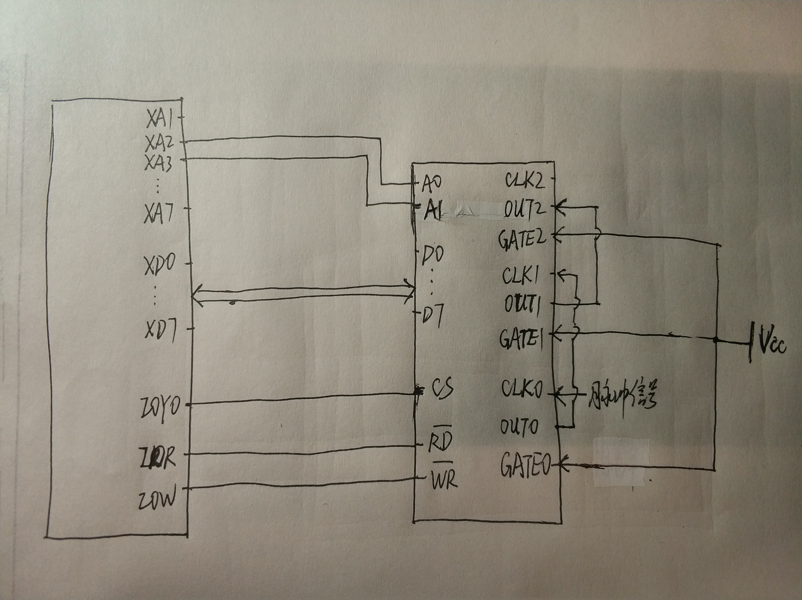
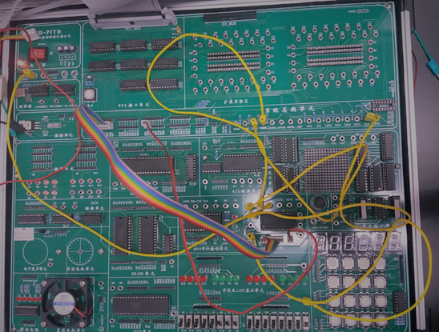
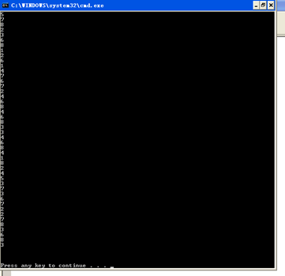
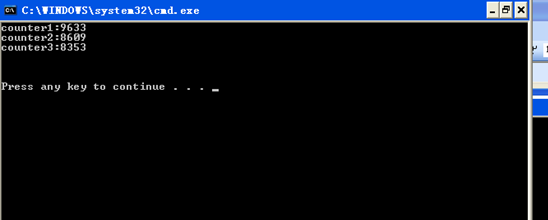
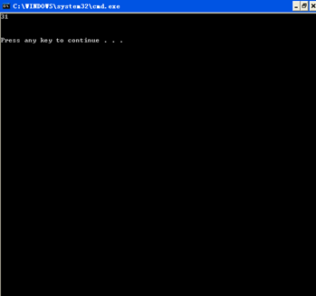

# 实验8：可编程计数器/定时器 8254 的使用

> 小组成员:吕建瑶1811400,郑佶1811464,吴京1811440

## 实验内容

1. 了解计数脉冲来时的计数规律.
2. 构建脉冲计数器,记录脉冲数.
3. 构建可编程定时信号发生器,并记录一个时间段内其发出脉冲的个数.

## 程序代码

```c
//1.c
#include <stdio.h>
#include <stdlib.h>
#include <conio.h>
#include <bios.h>
#include <ctype.h>
#include <process.h>
#include <time.h>

void main()
{
    int clk1,clk2;
    int i;
    int port_A=0x3000;
    int port_B,port_C,port_CMD;
    unsigned int b,c,a,d=0;
    port_B=0x3004;
    port_C=0x3008;
    port_CMD=port_A+12;
    outp(port_CMD,0x31);
    outp(port_CMD,0x71);
    outp(port_CMD,0xB1);
    outp(port_A,0xE8);
    outp(port_A,0x03);
	for(a=0;a<13567;a++)
	{
		for(i=0;i<(14652);i++)
			for(d=0;d<a%23+5568;d++);
				outp(port_CMD,0xC2);
		b=inp(port_A);
		c=inp(port_A);
		b=inp(port_A);
		c+=b*256;
		printf("%d\n",c);
	}
}

```

```c
//2.c
#include <stdio.h>
#include <stdlib.h>
#include <conio.h>
#include <bios.h>
#include <ctype.h>
#include <process.h>


void main()
{
	int clk1,clk2;
	int i;
	int port_A = 0x3000;
	int port_B,port_C,port_CMD;
	int b1,c1,a1,d1 = 0;
	int b2,c2,a2 ,d2= 0;
	int b3,c3,a3 ,d3= 0;
	port_B = port_A+4;
	port_C = port_A+8;
	port_CMD = port_A+12; 

	outp(port_CMD,0x31);
	outp(port_A,0x00);
	outp(port_A,0x00);
	outp(port_CMD,0x71);
	outp(port_B,0x00);
	outp(port_B,0x00);
	outp(port_CMD,0xB1);
	outp(port_C,0x00);
	outp(port_C,0x00);
	clk1=clock();
	do{clk2=clock();}
	while((clk2-clk1)<2);
	outp(port_CMD,0xDE);
	b1 = inp(port_A);
	c1 = inp(port_A);
	a1=	c1 +b1*256;
	b2 = inp(port_A);
	c2 = inp(port_A);
	a2=	c2 +b2*256;
	b3 = inp(port_A);
	c3 = inp(port_A);
	a3=	c3 +b3*256;
	clk1=clock();
	do{clk2=clock();}while((clk2-clk1)<10);
	outp(port_CMD,0xDE);
	b1 = inp(port_A);
	c1 = inp(port_A);
	d1=	c1 +b1*256;
	b2 = inp(port_A);
	c2 = inp(port_A);
	d2 = c2 + b2*256;
	b3 = inp(port_A);
	c3 = inp(port_A);
	d3 = c3 +b3*256;
	printf("counter1:%d\n",d1-a1);
	printf("counter2:%d\n",d2-a2);
	printf("counter3:%d\n",d3-a3);

}

```

```c
//3.c
#include <stdio.h>
#include <stdlib.h>
#include <conio.h>
#include <bios.h>
#include <ctype.h>
#include <process.h>
#include <time.h>
void main()
{
	int clk1,clk2;
	int i;
	int port_A = 0x3000;
	int port_B,port_C,port_CMD;
	int b1,c1,a1,d1 = 0;
	int b2,c2,a2 ,d2= 0;
	int b3,c3,a3 ,d3= 0;
	int x;
	port_B = port_A+4;
	port_C = port_A+8;
	port_CMD = port_A+12; 

	outp(port_CMD,0x36);
	outp(port_A,0x40);
	outp(port_A,0x02);

	outp(port_CMD,0x76);
	outp(port_B,0x80);
	outp(port_B,0x0C);

	outp(port_CMD,0xB0);
	outp(port_C,0xFF);
	outp(port_C,0xFF);
	outp(port_CMD,0xc8);
	a1=inp(port_C);
	a2=inp(port_C);
	a3=inp(port_C);
	printf("%d %d\n",a2,a3);

	clk1=clock();
	do{clk2=clock();}while((clk2-clk1)<55);
	outp(port_CMD,0xc8);
	d1=inp(port_C);
	d2=inp(port_C);
	d3=inp(port_C);
	printf("%d %d\n",d2,d3);

	x=(d2-a2)+(d3-a3)*256;
	printf("%d \n",x);

}

```

## 系统接线图



## 实验连线图



1:


2:


3:

